[TOC]

## 面临的主要问题和解决方案
面临的主要问题：
+ 机密性：内容不会泄漏；
+ 完整性：数据没有被篡改过；
+ 真实性：发送方是真实可信的，不是冒充的；
+ 不可否认性：发送方发出数据后，无法否认不是自己发的；

当代的解决方案：

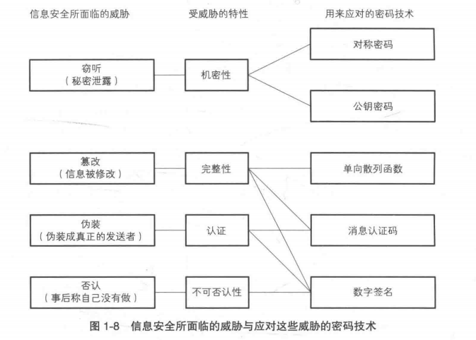


## 机密性
### 对称密码技术
密码技术 = 密码算法 + 密钥。算法是固定的，而密钥是不断变化的。

对称密码技术中，加密和解密使用相同的密钥。对称密钥，也可以叫共享密钥。

密码算法分类：
+ 分组密码：每次只能处理特定长度（分组长度）的一块数据；如果要处理任意长度，需要进行迭代；迭代模式有：ECB, CBC, CFB,OFB, CTR等；
+ 流密码：可以对数据流进行连续处理；

对称密码算法：
+ DES ： 分组密码，分组长度 64b；--- 不推荐使用
+ 3DES：分组密码；--- 不推荐使用；
+ AES ：分组密码，分组长度 128b,256b...； --- 推荐

推荐的分组密码的模式：
+ CBC: 支持并行解密，对于较小的文件大小是有效的，但对于大文件可能会遇到性能问题；
+ CTR: 支持并行加密、解密， 处理大文件时通常比 CBC 模式更快；

对称密码技术的缺点：
由于双方使用相同的密钥，发送者必须把密钥交给接收者才能解密，所以就面临如何安全交换密钥的问题。

### 非对称密码技术

非对称密码技术，又称为公钥密码技术，在加密和解密时使用不同的密钥。由于密钥是不同，就不存在交换密钥的问题了。

公钥和私钥：
+ 公钥和私钥是一一对应的，是成对生成的；
+ 公钥用来加密，可以直接发送，被窃取也没有关系；
+ 私钥用来解密，不可以被泄漏；

非对称密码算法：
+ RSA：推荐 2048比特及以上
+ ECC


非对称密码的使用流程：
+ 接收方生成一对公私钥；
+ 接收方把公钥交给发送方；
+ 发送方用公钥加密数据，发送密文；
+ 接收方用私钥解密数据；

非对称密码的优缺点：
+ 优点：不存在密钥交换的问题；
+ 缺点：处理速度很慢，可能只有对称密码的几百分之一。

根据 RFC6637，对称密码和非对称密码的强度对比：
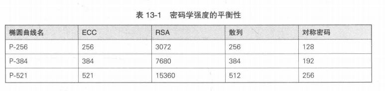


### 混合密码技术

由于对称密码和非对称密码技术都有各自的优缺点，所以把他们结合起来形成了混合密码技术。

主要流程：
+ 用伪随机数生成器生成会话密钥；
+ 用公钥加密会话密钥（对称密钥），然后交换会话密钥；
+ 接收方收到密钥的密文，用私钥解密获得会话密钥；
+ 双方使用会话密钥加解密，进行数据交换；


## 完整性

对称密码技术和非对称密码技术，只是解决了数据的机密性问题，无法解决中间人攻击数据被篡改的问题。要想保证数据的完整性，还需要增加完整性校验。

我们当然可以直接比较两个不同的文件，但如果文件很大就会很不方便。

每个人的指纹不同，只要比较指纹，就能区别不同的人。同样地，我们可以计算不同文件的“指纹”，然后比较来确定文件是否被篡改。

### 哈希函数

哈希函数(消息摘要函数、单向散列函数)，就是用来计算数据“指纹”的。密码技术中使用的哈希函数，要求还会更加严格。

密码技术中所使用的哈希函数/消息摘要函数，需要具备的特点：
+ 根据任意长度的消息计算出固定长度的哈希值；
+ 能够快速计算出哈希值；
+ 强碰撞性：消息不同，哈希值必须有非常大的概率不同 --- 要找到哈希值相同的两条消息非常困难；
+ 单向性：即无法通过哈希值反算出消息的特性；

常见的哈希函数：
+ MD5：已经不安全了，强碰撞性已经被攻破；
+ SHA-2系列: SHA-256, SHA-512
+ RIPEMD-160
+ SHA-3系列


## 真实性

完整性检验可以保证数据没有被篡改，但是无法保证发送者是真实的，发送者可能是冒充的。

### 消息认证码MAC(Message Authentication Code)

消息认证码MAC，是使用某种方法计算 消息+共享密钥 所得到的。由于计算 MAC 的过程需要用到共享密钥，而攻击者并不知道共享密钥，所以就无法冒充。

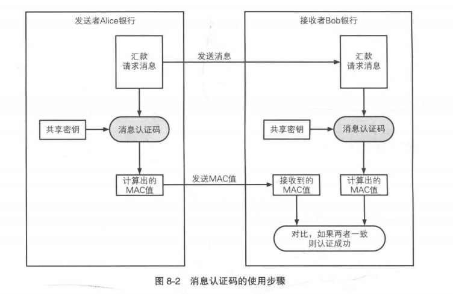

消息认证码的实现方法：
+ 哈希函数，例如：hmac；
+ 使用 AES 之类的分组密码，例如：AES-CMAC；
+ 公钥密码

### HMAC 

hmac 是一种利用哈希函数的消息认证码。

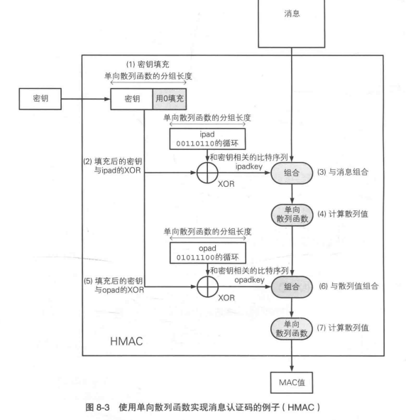

### 认证加密

认证加密（AEAD）是一种将对称密码 和 消息认证码结合，同时满足机密性、完整性、真实性的技术。

+ Encrypt-then-mac：先对称加密消息，再计算密文mac；
+ Encrypt-and-mac：对称加密消息，同时计算明文mac；
+ Mac-then-encrypt：先计算明文mac，再对称加密消息和mac；

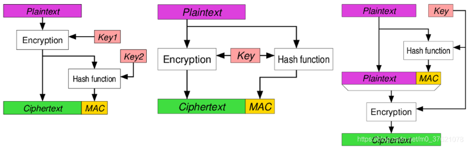


## 不可否认性

消息认证码虽然保证了消息的真实性，但是不能解决发送者否认的问题。发送者A发送消息后，完全可以声称消息不是自己发送的，比如：发送者可以声称这条消息是接收者伪造的。

要解决这个问题，需要有一种独一无二的、无法被伪造的信息。

### 数字签名 

数字签名是什么？为什么是独一无二的？
数字签名，是利用私钥，对数据的哈希值进行加密，所得到的一段密文。这段密文，只有拥有私钥才能生成，其他人无法生成，由于私钥是独一无二的，所以数字签名也就是独一无二的。


数字签名加签验签流程：

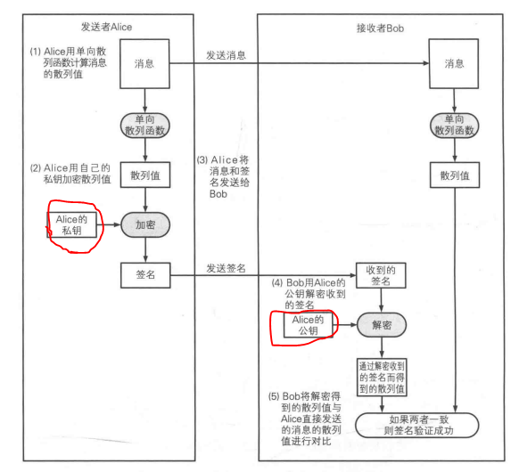

数字签名算法：
+ RSA 
+ DSA
+ ECDSA

数字签名的应用实例：
+ 公钥证书：公钥 + 数字签名得到公钥数字证书，用来保证公钥的安全；
+ 服务器证书：服务器公钥 + 数字签名得到服务器证书，用来认证服务器身份；
+ 客户端证书：客户端公钥 + 数字签名得到客户端证书，用来认证客户端身份，比如：USBkey;


### 数字签名和 HMAC 的差异

密钥管理：HMAC使用的是对称密钥，发送方和接收方必须共享同一个密钥。而数字签名使用的是非对称密钥，发送方使用私钥签名，接收方使用公钥验证签名。

不可否认性：HMAC 只能提供数据的完整性和来源验证，但无法提供不可否认性。

效率：HMAC通常具有更高的效率，因为它使用的是对称加密算法。

## 证书

数字签名技术中，验签需要用到公钥，如果公钥是伪造的，那么验签也就是无效的。如何保护公钥呢？解决方案是：数字证书。


### 用数字证书保护公钥
+ 什么是数字证书？

公钥证书和驾照很相似，里面记有姓名、组织、地址等个人信息，以及属于此人的公钥，并由认证机构(CA)施加数字签名。只要看到公钥证书，我们就可以知道认证机构认定该公钥属于此人。

认证机构就是能够认定"公钥确实属于此人"并能成数字签名的个人或者组织。认证机构中有国际性组织和政府所设立的组织，也有通过提证服务来盈利的一般企业。

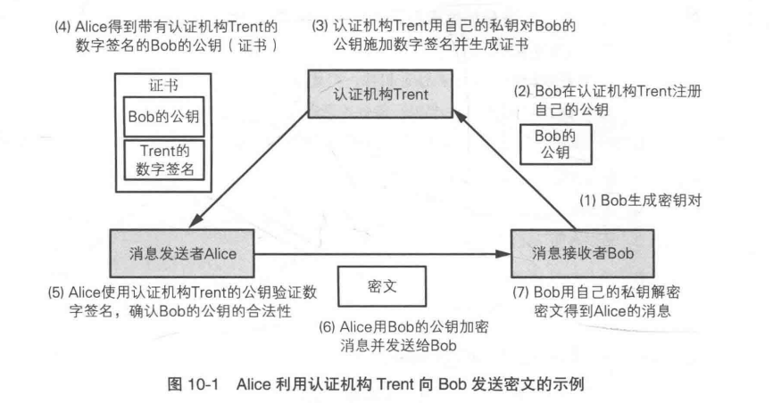

+ 数字证书中有哪些信息？

```
openssl x509 -in cacert.pem -noout -text

openssl x509 -in cacert.pem -noout -pubkey
```

public key algo: 使用本证书进行加密的算法；
signature algorithm: 使用本证书进行签名的算法；
公钥：是明文的；

+ 证书的编码方式

PEM 格式：这是最常见的证书格式之一，使用 Base64 编码表示，并以 .pem 扩展名结尾。PEM 格式通常包含一个包含证书或密钥的 ASCII 文本文件。

DER 格式：这是一种二进制格式，常用于机器之间的数据交换。DER 格式的证书通常以 .der 或 .cer 扩展名结尾。

PKCS#12/PFX（Public Key Cryptography Standards #12）格式：这是一种包含证书、私钥和其他相关信息的二进制格式。PKCS#12 文件通常以 .pfx 或 .p12 扩展名结尾。

在进行证书操作时，你可能需要将证书从一种格式转换为另一种格式，以适应不同的环境和要求。


### 公钥基础设施(PKI)

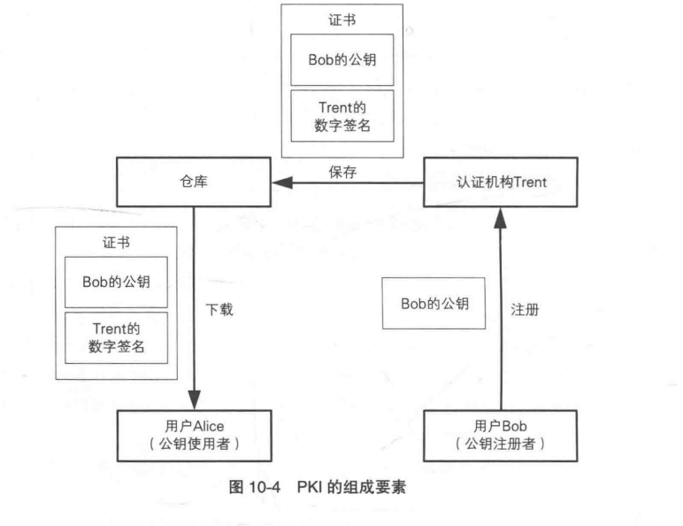

PKI 是为了能够有效运用公钥系统建立的。

认证机构是分层级的，上一层对下一层的有效性进行校验，因而证书也是分层级的，上一层的证书负责校验下一层的有效性。最顶层的证书，称为根证书，根证书是默认有效的。一般浏览器和操作系统会内置一些证书。

### 验证数字证书的合法性

假设我们现在有一张证书，如何验证证书的有效性？
该证书要在有效期内，同时上一级证书校验成功，还要查询认证机构最新的 CRL 清单确保证书没有作废。

CRL 清单（证书作废清单），一般是用户自己更新。


## TLS 协议

TLS 协议是在 SSL 的基础上修改扩展设计出来的协议。

TLS 协议分为2个部分：
+ 握手协议：协商确定密码套件、交换证书、生成共享密钥；
+ 记录协议：负责消息的压缩、加密和数据的认证；

TLS 记录协议的主要流程：
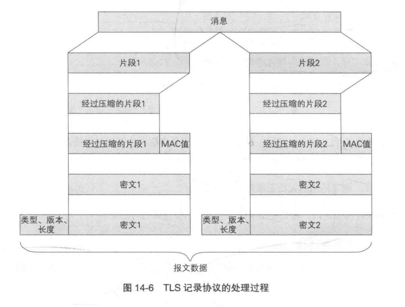


TLS 握手协议的主要流程：
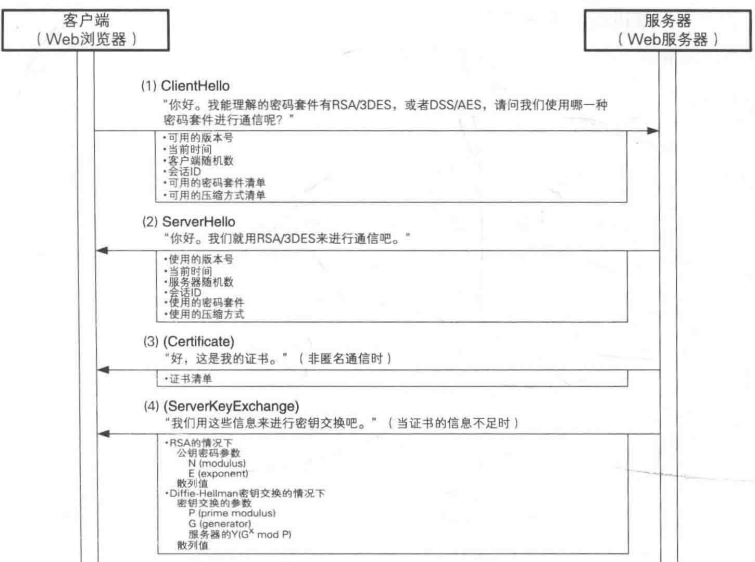
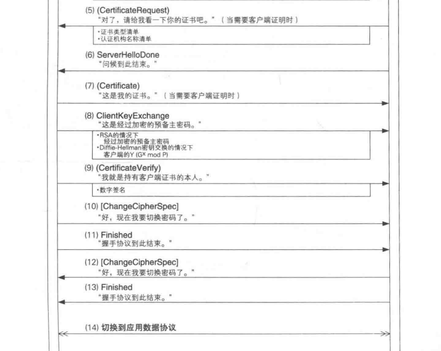

TLS 各版本使用的认证方式：
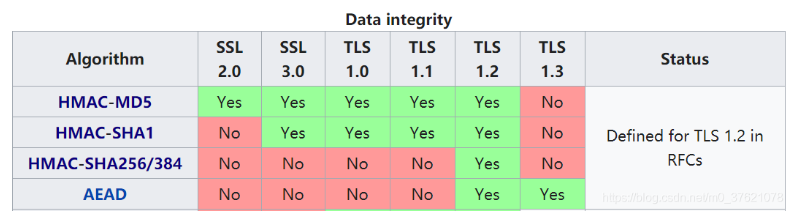

### AES-GCM

TLS1.3 使用 AES-GCM 来进行加密认证。

AES是一种对称加密算法，用于对数据进行加密和解密。它接受不同长度的密钥，包括128位、192位和256位。在AES加密中，数据被分成固定长度的块（128位），然后使用密钥进行加密。AES具有高度的安全性和效率，因此成为了许多加密协议和应用程序的首选算法。

GCM是一种认证加密模式，它结合了CTR模式和Galois/Counter模式。GCM不仅提供了加密功能，还包括了消息认证码（MAC）以验证数据完整性。GCM使用一个计数器（Counter）来生成加密所需的虚拟块，同时也用于生成消息验证码。GCM还引入了Galois Field上的乘法运算，以提供高效的完整性验证。

工作原理：
加密过程：首先，AES-GCM算法使用CTR模式对明文进行加密，生成密文。在这个过程中，使用了加密密钥和初始化向量（IV），以及可能的附加数据（Additional Authenticated Data, AAD）。

消息认证码计算：在加密完成后，使用Galois/Counter Mode中的乘法运算，结合加密过程中的计数器值和密钥流，生成消息认证码。这个消息认证码用于验证数据的完整性和真实性。

输出密文和消息认证码：最终输出的密文中包含了加密后的数据，以及计算得到的消息认证码。

解密：当接收方收到密文后，首先使用相同的密钥、IV和可能的附加数据来解密密文。

认证：使用相同的参数和相同的AES-GCM算法，在不进行解密的情况下计算期望的消息认证码。这一步实际上是对密文进行认证，而不是解密操作。

参数的作用：
加密密钥：加密密钥是用于对明文进行加密和解密的关键。在AES-GCM中，加密密钥通常是128位、192位或256位长，具体长度取决于所选的密钥长度。缺少加密密钥将导致无法进行加密和解密操作，因此数据将无法得到保护和恢复

初始化向量（IV）：初始化向量是在加密过程中用于引入随机性和避免重复加密结果的参数。它与密钥一起用于初始化加密过程中的计数器。在AES-GCM中，IV通常是96位长，但也可以是其他长度。缺少初始化向量将导致在相同密钥下多次加密相同的数据会暴露重复的密文块，这可能会导致安全性受损。

可能的附加数据：这是可选的输入，它与明文一起参与消息认证码的计算。附加数据不会被加密，但会被用于计算消息认证码，从而确保附加数据的完整性和真实性。举例：消息的源地址作为附加数据。


消息认证码的长度？
GCM模式中的消息认证码是由一个称为GMAC（Galois Message Authentication Code）的算法生成的，而GMAC的输出长度固定为128位。


## OpenSSL 用法
OpenSSL 是一个开源的加密库，它提供了一套用于网络通信安全的加密和解密算法、协议以及常用的密码学工具。

OpenSSL 的主要作用包括：
+ 加密和解密：提供了对称加密算法（如 AES、DES）、非对称加密算法（如 RSA、ECC）和哈希函数（如 SHA-1、SHA-256）等，可以用于保护数据的机密性和完整性。

+ 安全通信：实现了常用的安全协议，如 SSL/TLS，可以在网络通信中提供加密和身份验证，确保数据传输的安全性。

+ 数字证书管理：支持 X.509 标准数字证书的生成、签名、验证、导入和导出等操作，可用于进行身份认证和数据完整性验证。

+ 随机数生成：提供了高质量的随机数生成器，用于生成安全的随机数和密钥材料。

+ 密码学工具：提供了一系列便捷的密码学工具，例如计算哈希值、生成消息认证码（MAC）、进行密码学强度测试等，方便开发人员在应用中使用密码学算法。

### 生成密码强度高的随机数

```bash
# /dev/random 提供真正的随机性，但当熵池中的随机性不足时会阻塞读取操作，
openssl rand -hex [number_of_bytes] < /dev/random

# 提供非阻塞的伪随机数，其随机性根据熵池中的可用数据生成。如果数据不足，则通过算法生成伪随机数，但并不会阻塞。
# 在大多数情况下是更常用和推荐的随机数源。
openssl rand -hex [number_of_bytes] < /dev/urandom
```


```c 
#include <openssl/rand.h>
#include <stdio.h>

void gen_random(int len, unsigned char *out) {
    if (len <= 0 || out == NULL) {
        fprintf(stderr, "Invalid input parameters for random number generation.\n");
        return;
    }

    // 初始化随机数生成器
    if (RAND_load_file("/dev/urandom", 64) != 64) {
        fprintf(stderr, "Error loading random data for seed.\n");
        return;
    }

    // 生成随机数
    if (RAND_bytes(out, len) != 1) {
        fprintf(stderr, "Error generating random bytes.\n");
        return;
    }
}
```

### 生成证书以及签署其他证书

```bash
# 生成自签名 CA 证书
### 生成私钥
openssl ecparam -name prime256v1 -genkey -noout -out ca.key
### 证书请求文件
openssl req -new -key ca.key -out ca.csr
### 证书
openssl x509 -req -in ca.csr -signkey ca.key -out cacert.pem -days 365
### 查看证书
openssl x509 -in cacert.pem -noout -text


## 使用 CA 证书给其他证书签名
### 生成私钥
openssl ecparam -name prime256v1 -genkey -noout -out p.key
openssl ecparam -name prime256v1 -genkey -noout | openssl ec -aes256 -out p.key

### 证书请求文件
openssl req -new -key p.key -out p.csr
### signature
openssl x509 -req -in p.csr -CA cacert.pem -CAkey ca.key -CAcreateserial -out cert.pem -days 365

### p.key 是私钥，cert.pem 是公钥数字证书
### 查看私钥，公钥证书
openssl ec -inform pem -in p.key -text -noout
openssl x509 -in cert.pem -text -noout
```


### 验证证书 
```bash
# 显示证书信息
openssl x509 -in <证书文件路径> -text -noout

# 显示公钥证书的公钥
openssl x509 -in <证书文件路径> -pubkey -noout

# 使用 CA证书 验证普通证书
openssl verify -CAfile cacert.pem cert.pem
```

```c
// 验证证书
#include <stdio.h>
#include <openssl/x509_vfy.h>
#include <openssl/x509.h>

int verify_certificate(const char* ca_cert_path, const char* cert_path) {
    X509_STORE* store = X509_STORE_new();
    X509_STORE_CTX* ctx = X509_STORE_CTX_new();

    // 加载 CA 证书
    if (X509_STORE_load_locations(store, ca_cert_path, NULL) != 1) {
        printf("Failed to load CA certificate\n");
        return -1;
    }

    // 加载待验证的证书
    X509* cert = X509_new();
    FILE* file = fopen(cert_path, "r");
    if(file == NULL) {
        printf("Failed to open certificate file\n");
        return -1;
    }
    PEM_read_X509(file, &cert, NULL, NULL);
    fclose(file);
    
    // 初始化验证上下文
    X509_STORE_CTX_init(ctx, store, cert, NULL);

    // 执行验证
    int result = X509_verify_cert(ctx);
    if (result != 1) {
        printf("Certificate verification failed\n");
        X509_STORE_CTX_cleanup(ctx);
        return -1;
    }

    // 验证通过
    printf("Certificate verification succeeded\n");

    X509_STORE_CTX_cleanup(ctx);
    X509_STORE_free(store);
    X509_free(cert);

    return 0;
}

int main() {
    const char* ca_cert_path = "/path/to/cacert.pem";
    const char* cert_path = "/path/to/cert.pem";

    int result = verify_certificate(ca_cert_path, cert_path);
    if (result == 0) {
        printf("Certificate is valid\n");
    } else {
        printf("Certificate is invalid\n");
    }

    return 0;
}

```


### 加密和解密
```bash 
# 对称加密 解密
openssl rand -hex 32 > key.txt

openssl enc -aes-256-cbc -in plaintext.txt -out encrypted.txt -pass file:key.txt

openssl enc -d -aes-256-cbc -in encrypted.txt -out decrypted.txt -pass file:key.txt


# 非对称加解密
openssl ecparam -name prime256v1 -genkey -noout -out private_key.pem
openssl ec -in private_key.pem -pubout -out public_key.pem

openssl pkeyutl -encrypt -pubin -inkey public_key.pem -in plaintext.txt -out encrypted.txt

openssl pkeyutl -decrypt -inkey private_key.pem -in encrypted.txt -out decrypted.txt


# 处理大文件 AES-CTR 更适合
openssl rand -hex 16 > key.txt
openssl rand -hex 16 > iv.txt

openssl enc -aes-128-ctr -in plaintext.txt -out encrypted.txt -K $(cat key.txt) -iv $(cat iv.txt)

openssl enc -aes-128-ctr -d -in encrypted.txt -out decrypted.txt -K $(cat key.txt) -iv $(cat iv.txt)
```

```c 
# AES 加解密


```


### hash 计算
```bash
# hash
openssl dgst -sm3 data.txt > hash.txt

# hmac
# SM3 算法使用的 HMAC 密钥长度应与哈希算法的输出长度相同，32字节
openssl rand -hex 32 < /dev/urandom > key.txt
openssl dgst -sm3 -hmac $(cat key.txt) data.txt
```


### 加签、验签


## 参考资料

+ 《图解密码技术》