[TOC]

## 财务报表基础知识
+ 企业主要的商业活动

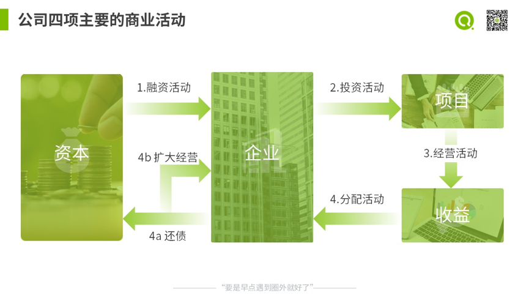

+ 获取财务数据

上市公司，通过资产负债表、利润表与现金流量表

非上市公司，则主要透过同行对手，与该企业相关的人士获得相关财务数据。比如：透过厂商的上游供应商获得债务信息、透过行业圈子获得盈利信息、透过厂商内部朋友圈获得的现金状况等

+ 借贷记账法

借和贷，本质是一种符号，左边是借方，右边是贷方。
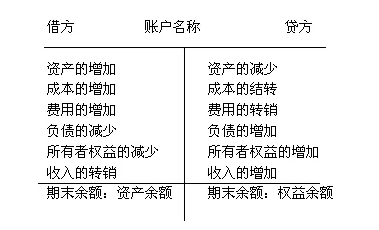

### 资产负债表

资产 = 负债 + 所有者权益，反映了企业的融资、投资活动  
负债：债权融资  
所有者权益： 股权融资  
资产：包括流动资产和固定资产，反映了企业的投资活动，资金被投向了什么项目  

+ 从资产负债表看企业的融资方式

应付账款：没有利息；恶化与供应商的关系   

短期贷款：融资成本比较低；一年内到期，偿债压力比较大；

长期贷款：短期还款压力小，可以用于更长期投资；融资成本高于短期，而且一般金额巨大   

股权融资：股权融资是有成本的，而且成本是最高的    

+ 重资产

重资产，在资产负债表上，体现为：固定资产。固定资产，面临折旧和减值，影响资产负债表和利润表。

+ 轻资产

轻资产，在资产负债表上，体现为：其他无形资产（专利版权等）、商誉。  
其他无形资产，面临摊销和减值，影响资产负债表和利润表。  
商誉，不用摊销，但面临减值。  

+ 商誉

企业A净资产100万，企业B以120万收购它。多出来的20万，买到的是什么呢？就是商誉。

商誉是企业的超额获利能力。正是这种超额获利能力的存在，使B愿意多支付20万。

商誉一般来源于：独特的地理位置、资源，特殊的生产工艺等。

+ 商誉和无形资产的区别

无法以一种有效的方式计量。现在一般会计上只确认外购商誉，即外部兼并收购形成的商誉。

具有很大的不确定性。超额的获利能力与外部环境有关，在某一个时期具有这种能力，到了另一个时期可能就没有了。

商誉无法单独分辨。无法脱离企业而单独存在，无法像专利一样单独交易。

+ 问题讨论：无形资产占比高代表更有创新能力吗？

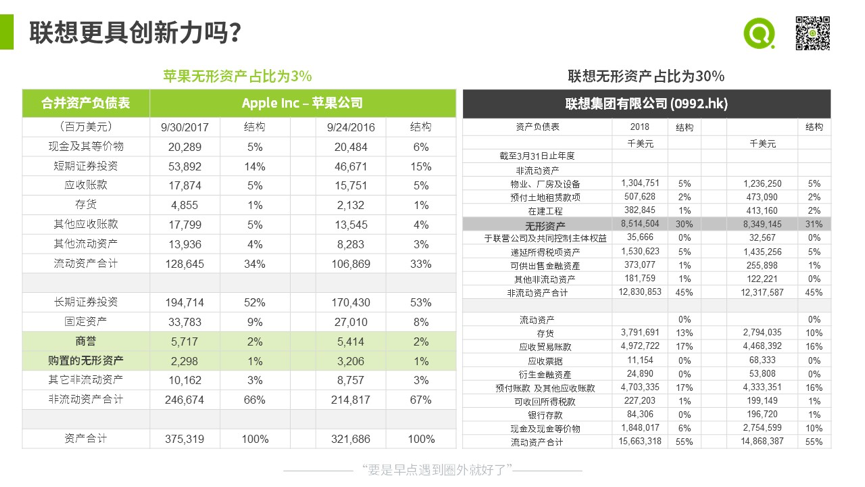
联想的无形资产占比30%，远高于苹果，是因为联想对外并购形成了很高的商誉、外购了很多专利。

+ 股东权益

股本：
资本公积：股东实际投入的资金 - 股本  
盈余公积：中国特色项目，法律不让分配的利润  
未分配利润：

### 利润表
营业收入 - 营业成本 = 销售毛利  
销售毛利 - 营业费用（三费、资产减值损失、公允价值变动收益、投资收益） = 营业利润  
营业利润 + 营业外利润 - 所得税 = 净利润 

+ 企业利润表为什么要分成多步计算？
  
设想这个场景：同行业的另一家竞争公司，净利润比我司高，为什么呢？这时就要去对比分析，是营业收入、营业成本、营业费用、利息费用中哪一个导致的？

+ 资本化和费用化的影响

资本化，就是将本期发生的支出分摊到以后多期。减少了对本期利润的影响。

+ 加速折旧的优劣

加速折旧下，固定资产的价值按照双曲线变化。
优点：前面折旧的多，后面折旧的少，可以起到减少税收支出的作用
缺点：

### 现金流量表 

+ 现金流量表的作用

现金流量表描述了企业现金的来源，反映了企业的风险状况。银行提供贷款时，最关注的就是现金流量表。

+ 利润和现金的比较

现金有形、可计量、而且真实，但是利润不真实。
因为利润可能包括现金、存货、固定资产。存货可能高估了，设备可能只能按照废物卖出，故利润难以准确计量。

+ 为什么营业利润和经营活动现金流不一致呢？  

东西卖出去了，钱却没有收到，表现为：存货增加或应收账款增加

+ 利润更重要还是现金流更重要？

本质问题：是赚钱更重要还是生存更重要？当风险巨大的时候，现金流更重要；当风险可控时，利润更重要。

+ 企业不同阶段的一般现金流
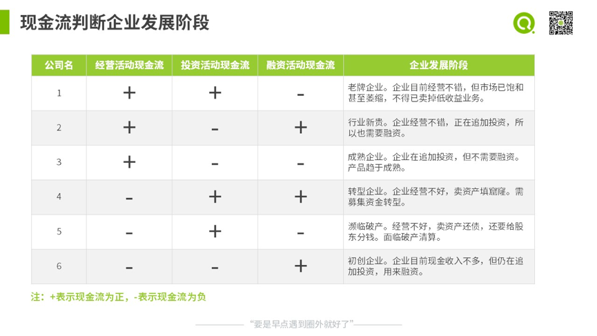

## 基本的财务分析方法
### 比较法
对比不同企业的财务报表，其实是数据分析中的外部对比分析法。  

+ 如何选择对比对象

同一个行业，产品和服务接近  
产品所覆盖的市场比较接近  
企业规模比较接近，规模用营业收入来衡量   

### 结构分析
结构分析，就是分析每一项占总的百分比。比如，利润表中的每一项占收入的比例。

这个有什么用呢？当遇到两家公司某个财务指标不一样，我们又想搞清楚为什么不一样，我们就可以用结构分析找出根源。

### 评估企业偿还短期负债的能力
+ 流动比率

流动比 = 流动资产 / 流动负债  

+ 速动比率  

速动比 = （流动资产 - 存货） / 流动负债

+ 流动比率多少合适呢？是不是流动比率越高越好？

一般认为，流动比要大于2才比较安全。因为流动资产负有2个职责，偿还流动负债和提供营运资金，流动比等于1企业无法持续经营。

另外，流动比低于1，短期偿债压力是比较大，但由于债务是在一年内到期，并不是明天到期，所以仍然可以通过持续经营增加流动资产偿还负债。

根据针对美国企业的研究，破产企业在破产前一年的流动比普遍是2，健康企业在同一时段的流动比普遍是3+。

中国则有自己的特色，由于银行一般不愿意给企业提供长期贷款，而是提供循环的短期贷款（借新还旧），导致中国企业普遍流动比低于2。如果剔除短期借款，其实健康企业的流动比也不低。

流动比和速动比越高，代表短期偿债能力越强；但过高的流动比率也意味着企业有过多的流动资产，难以带来更高的收益。

+ 对比苹果和联想的流动性
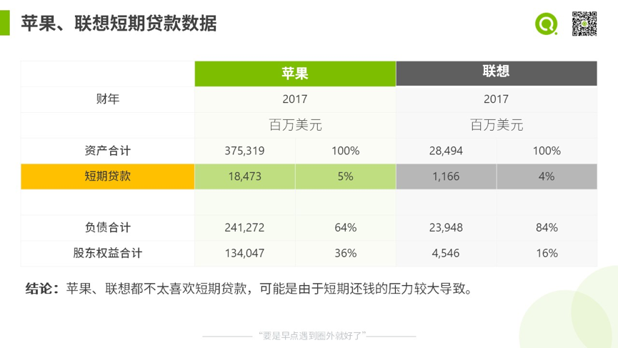
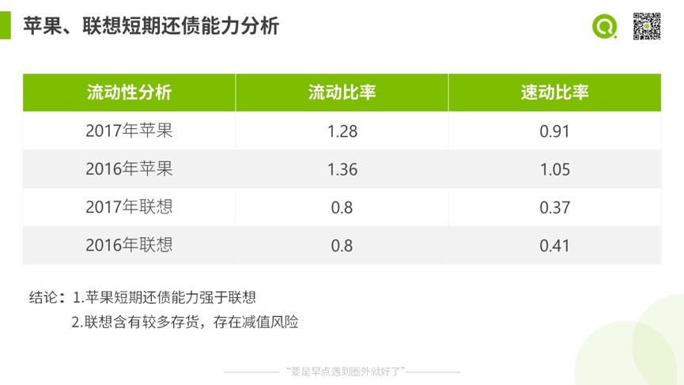

### 评估企业偿还长期负债的能力
+ 利息保障倍数

利息保障倍数 = 息税前利润（EBIT）/ 利息费用 

+ 资产负债率

资产负债率 = 总负债 / 总资产

目前，中国上市公司平均资产负债率是40%多。

### 评估企业供应链经营效率
+ 周转率

用各类资产的周转率，来衡量资产的营运能力  

总资产周转率 = 营业收入 / 总资产，反映总资产的营运能力  
应收账款周转率 = 营业收入 / 应收账款  
存货周转率 = 营业成本 / 存货  

流动资产周转率 = 营业收入 / 流动资产  
固定资产周转率 = 营业收入 / 固定资产  

+ 应付账款天数 

365 * 应付账款 / 营业成本，优点：天数越长，无偿占用供应商资金越长，缺点：影响和供应商关系

+ 存货周转天数

365 * 存货 / 营业成本，优点：企业存货能促进销售，客人要的时候能直接卖出；缺点：资金被无偿占用了，存货还有减值风险。企业一般总是希望商品卖得快，减少商品占用的资金。

+ 应收帐款周转天数

365 * 应收帐款 / 营业收入，优点：促进销售；缺点：被客户无偿占用资金导致低收益，以及坏账风险。应收帐款周转天数越短，拿回货款越及时，坏账风险也降低了。

+ 现金周转天数

应收帐款周转天数 + 存货周转天数 - 应付账款天数，衡量供应链资金使用效率的综合指标。负数，说明资金使用效率很高，用供应商的钱就能把供应链运转起来；正数，说明你要在供应链上投入运营资金。

+ 比较苹果和联想的经营效率

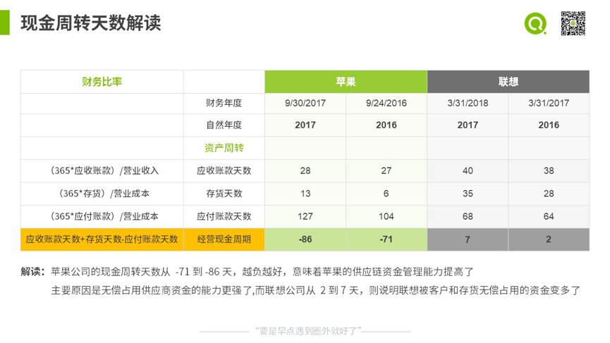

从现金周转天数看，苹果的供应链效率提升了。

### 评估企业的盈利能力
+ 营业收入和营业收入增长率

企业的营业收入和增长率越大，就代表企业规模越大。  

+ 毛利率 

毛利率，直接反映了市场的竞争激烈程度和产品的竞争力，越高越好。  

毛利率 = （营业收入 - 营业成本） / 营业收入

+ 营业利润率和营业利润增长率

营业利润，指主营业务利润。
营业利润率 = 营业利润 / 营业收入  
这两个指标反映了企业核心业务的可持续盈利能力，好的公司营业利润率一定是高于行业平均的。

+ 净利率

净利润 = 营业利润 + 营业外利润 - 所得税费用  
净利率 = 净利润 / 营业收入

+ 净资产收益率

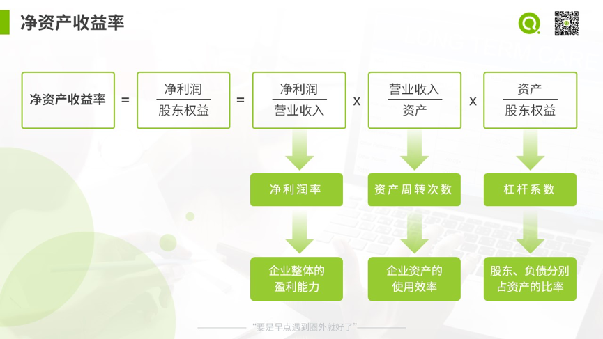

ROE = 净利率 * 资产周转率 * 权益乘数

根据杜邦公式，竞争策略一：差异化，体现为净利润率高 + 资产周转慢；竞争策略二：成本领先，体现为净利润率低 + 资产周转率高

根据杜邦公式，杠杆是一把双刃剑，可以赚的更多，也会亏得更多。

### 评估企业的盈利质量

+ 经营活动现金流和净利润  

经营活动产生的现金流 / 净利润，大于1代表盈利质量好，小于1则需要关注。

+ 对比苹果、联想盈利质量

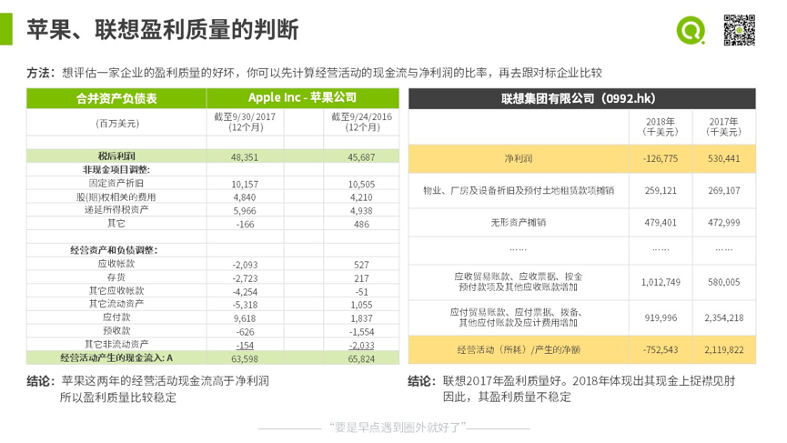

+ 自由现金流

自由现金流 = 经营活动现金流 - 投资活动现金流

自由现金流为正，企业既有能力支撑投资活动，又有盈余给股东分红，是经营良好做大做强的表现。

相反，如果自由现金流是负的，不仅不能向股东分红，还要进一步融资。

## 业务战略如何影响财务数据
不同企业的财务数据，为什么会有那么大差异？这里面存在外部和内部影响因素：
+ 新进入者的威胁
+ 替代品的威胁
+ 与同业竞争者的竞争程度
+ 供应商的议价能力
+ 购买者的议价能力

### 外部对标看行业特征
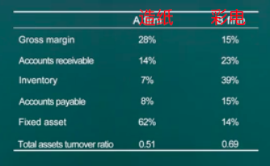

从图上，可以得出如下结论：
+ 彩电企业毛利率更低，这是同业竞争更激烈，这可能是由于彩电业竞争者众多，而造纸业竞争者少；
+ 彩电企业应收账款比率更高，这是因为彩电业购买者的议价能力更高，也就行业竞争激烈的体现；
+ 彩电企业存货比率更高，同业竞争激烈的体现；
+ 造纸企业应付账款比率更低，因为造纸业的上游原材料匮乏，大量依赖进口，供应商议价能力更高；
+ 造纸企业固定资产比重更高，大约1吨产能投资规模在一个亿，主要投资于机器设备。可见，造纸业是个资金密集型行业；

### 纵向对标看行业演变
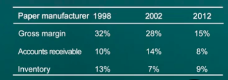
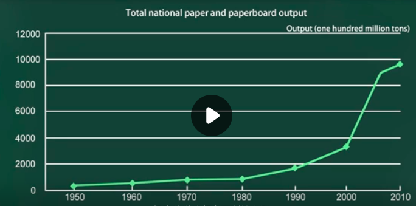

+ 毛利率下降，尤其是02年到12年下降尤其多, 可见行业竞争加剧。从造纸业的产能数据看，产能的确在不断增长，2000年以后增长尤其快。
+ 从98-02，应收账款增加存货减少，可以看出企业在降低毛利的同时也采取了赊销的策略；
+ 从02 -12，应收账款减少存货增加，可以看出面对激烈的竞争，企业经营策略又有所变化，并没有一味赊销； 

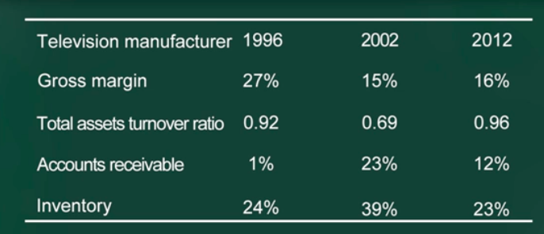

+ 毛利率从96-02 不断下降，是行业竞争日益激烈的表现；从 02-12 毛利率基本稳定，是行业竞争格局稳定的体现；
+ 总资产周转率、应收帐款、存货，96-02 同时大幅增加，表明行业竞争非常激烈以及企业竞争力不足；
+ 总资产周转率、应收帐款、存货，02-12 都在减少，可能是企业提升了管理能力；（其实如果进一步研究财报，发现不是；这是因为企业计提了大量应收损失等原因导致）

### 横向对标看企业战略、执行
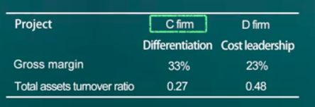

+ C 公司采用了差异化战略，高毛利低周转；
+ D 公司采用了成本领先战略，低毛利高周转；

## 如何根据报表排除公司
### 上市公司年报重点看什么
重要提示：会计师意见及异常情况说明。如果有异常，直接毙掉。

财务三表

董事会报告：对照过去几年的报告，及之后的财务三表，看董事会是否可信、对市场判断是否准确

重要事项  

财务附注：企业必须披露又不太想让你明白的东西，一般藏在附注里。

+ 会计制度是否一致，
+ 关联企业与子公司是否有大笔账目进出（意味董事会不重视股东利益，有就直接把它毙掉），
+ 重要资产转让（大股东轻视股东利益，直接毙掉）
+ 特殊项目：非经常性损益

## 其他