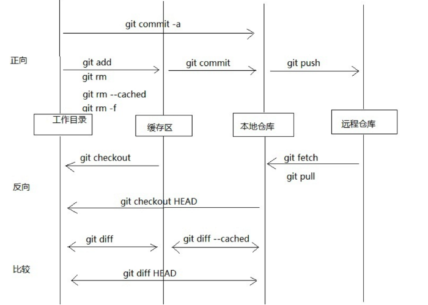

[TOC]

Git 是什么？  
Git 是一个分布式的版本控制系统，区别于集中式如 SVN。

Git 的作用：
+ Git 保存了每一次的修改记录，有利于更好、更快地排查错误 
+ 分支管理：当你开发一个新功能，又想保持原代码的稳定，可以选择在分支上开发 

## 建立仓库
### 安装并配置 Git

```
# 安装
sudo apt-get install git
# 配置用户名、邮箱
git config --global user.name "XXX"
git config --global user.email "XXX@gmail.com"
# 查看配置
git config -l
```

### 注册 GitHub
1. 注册 GitHub   
2. 创建 ssh key，命令行输入：`ssh-keygen -t rsa -C “XXX@gmail.com”`    
3. GitHub 上的 setting 页面 add ssh key

### 检出远端仓库
``` 
# 克隆一份远端仓库到本地 
git clone <repo>

# 克隆时自定义 目录名称
git clone <repo> <directory>

# 克隆后拉特定分支
git fetch origin <branch>
```

## 查看各个分支的历史提交

我们看到的历史信息，仅仅是已经存放在本地版本库中的。对于已经提交到远程仓库但没有 fetch 下来的提交，是无法查到的。

根据查看历史提交的目的，学习如下命令
```
# 设置 log 的默认输出格式

# 我当前所在的版本
git log

# 查看特定版本的修改内容
git show <commit>

# 某段时间/某2个版本/某2个tag，做了哪些修改，会影响哪些功能
## --stat : 显示修改了哪些文件
## -p     : 显示具体修改内容
git log --after="2022-1-1" --before="2022-6-30"
git log id1..id2
git log id1..HEAD
git log V1.4..V1.5

# 某个文件，某段时间/某2个版本/某2个tag之间，有哪些修改，会影响哪些功能 
git log --after="2022-1-1" --before="2022-6-30" <file>
git log id1..id2 <file>
git log id1..HEAD <file>
git log V1.4..V1.5 <file>

# 修改/问题，是谁引入的，是什么时候引入的
## 搜索作者、提交信息中的关键字
git log --author="<pattern>" --grep="<pattern>" <file>
## 按提交内容，显示增加、减少该模式的提交记录
git log -S"<string>" <file>
git log -G"<regex>" <file>

```

## 提交代码
```
# 文件状态
git status

# 查看工作区修改了什么
git diff
git diff <file>

# 将修改放到暂存区/缓冲区
git add test.txt
# 将目录下的全部修改提交到暂存区
git add <dir>

# 删除文件
git rm <file>
# 重命名
git mv f1 f2

# 查看缓冲区修改了什么
git diff --cached
git diff --cached <file>

# 提交到版本库
git commit -m "Feat: new feature"

# 出现漏提交, 最终只会有一次提交记录；
# 原理：删除原来的提交，新建一个提交
# 不要对已经提交到远程库的提交 amend，即不要修改远程库的历史
git add forgotten_file
git commit --amend -m "I forget a file, but I fix this problem"


# 更新远程库
## 切换到目标分支，比如：master
git checkout master
## fetch: 把远程仓库的提交拉下来，储存为版本库中的远程分支，不会影响你正在修改的本地分支
## 拉全部分支
git fetch <remote>
## 拉指定分支
git fetch <remote> <branch>
git fetch origin master
## 查看到本地当前的全部分支
git branch -a


# 合入远程库
## rebase 方式合入, 可以保持项目历史线性
git rebase origin/master
## merge 合入
git merge <remote>/<branch>
git merge origin/master
## 以上操作合并：fetch 远程的 branch，并合入本地当前分支
git pull <remote> <branch>
git pull --rebase <remote> <branch>


# 推送
# 把 src 分支推送到 dst 分支
# 如果省略 :dst ，或者根据配置决定目的分支，或者就是远程的同名分支
git push <repo> <src branch>:<dst branch>
git push orgin master:<dst>
git push origin master
```

## 回退代码
```
# 回退操作，还是用图形化工具最好

## 建议：针对还没有 push 的代码，回退用 reset
## 准备提交到暂存区，却发现改错了。 
## 如果是少量错误，就在工作区重新修改，然后再提交
## 如果大量错误，就回退到 HEAD 节点；
## 原理：移动 HEAD 指针，后面的提交看不见了, 同时暂存区、工作区也替换了
git reset --hard <commit>
git reset --hard HEAD~2

## 建议：针对已经 push 到远程库的代码，回退用 revert
## 原理：再反向修改回去，提交一个新版本，不影响之前提交的内容
git revert <commit>
## 回退最近3个版本， (HEAD~3,HEAD]
git revert HEAD~3..HEAD


# reset 有时候错误回退了，又想撤销
# 这时必须看以前的操作命令，从中找到后面的版本号
git reflog


# 创建一个干净的工作区
## 首先 reset，然后测试删除，最后真正删除所有未跟踪的文件、目录
git reset --hard
git clean -n
git clean -df
```

## 分支
fork 一个分支，或者是为了紧急修复，或者是先开发新功能再合入主干。建议在远程仓库的界面上操作
```
# clone 指定分支
git clone -b develop XXXX

# 显示全部分支 
git branch -a 

# 基于 HEAD 创建分支
git branch <branchname>
# 基于 commit 创建分支
git branch <branchname> <commit>

# 切换到一个已有分支
git checkout <branchname>

# 把另一个分支的某些提交合并到本分支，区别于 merge
## 合入某次提交
git cherry-pick <commit>
## 合入某些提交
git cherry-pick <cit1> <cit2>
## 合入某个范围 (cit1, cit2]
git cherry-pick <cit1>..<cit2>
## 如果发生冲突，处理完后
git add .
git cherry-pick --continue
## 放弃合并，退回合并前
git cherry-pick --abort


# 工作流一：推到远程仓库，保留该分支
git push origin <branchname>

# 工作流二：合入后，删除该分支
git add XX
git commit XX
git push origin <branchname>

## 获取最新 master 分支
git checkout master
git pull origin master
## 分支合入 master，要有合并记录
git merge --no-ff <branchname>
## 推送到远程库
git push origin master
## 删除该分支
git branch -d <branchname>
## 删除远程分支，建议在远程仓库的界面上操作
git push orgin -d <branchname>

# 工作流三：提交后，发起 pull request，评审通过后，再合入代码

# 查看哪些分支合并到了当前分支，哪些还没有合并 
git branch --merged 
git branch --no-merged
```


## Tag 

## 深入学习 Git
### 原理
#### 结构


#### 快照
记录快照，而不是记录差异。SVN 追踪文件的变化 ，而 Git 的版本控制模型基于快照 。比如说，一个 SVN 提交由仓库中原文件相比的差异（diff）组成。而 Git 在每次提交中记录文件的完整内容。

#### origin
当你用 git clone 克隆仓库时，它自动创建了一个名为 origin 的远程连接，指向被克隆的仓库。

#### HEAD 
记住，HEAD 是 Git 指向当前快照的引用。

git checkout 命令内部只是更新 HEAD，指向特定分支或提交。当它指向分支时，Git 不会报错，但当你 check out 提交时，它会进入「分离 HEAD」状态。

如果你在分离 HEAD 状态开始开发新功能，没有分支可以让你回到之前的状态。当你不可避免地 checkout 到了另一个分支（比如你的更改并入了这个分支），你将不再能够引用你的 feature 分支。

### 配置
```
/.git/config – 特定仓库的设置。

~/.gitconfig – 特定用户的设置。这也是 --global 标记的设置项存放的位置。

$(prefix)/etc/gitconfig – 系统层面的设置。

/.gitignore - 特定仓库忽略某些文件类型

# 告诉Git你是谁
git config --global user.name "John Smith"
git config --global user.email john@example.com

# 选择你喜欢的文本编辑器
git config --global core.editor vim

# 添加一些快捷方式(别名)
git config --global alias.st status

git config --global alias.co checkout

git config --global alias.br branch

git config --global alias.up rebase

git config --global alias.ci commit

# 显示配置信息
git config -l
git config --local -l
git config --global -l
git config --system -l


# 配置默认 log 输出格式
git config --global format.pretty "%h %cn %cd %s"
git config --global log.date format:"%Y-%m-%d %H:%M:%S"

# 强制 rebase 方式合入 
git config --global pull.rebase true
```

### 其他命令
```
# 显示远程连接的信息
git remote -v

# 创建一个远程仓库连接
git remote add <name> <url>

# 移除一个远程连接
git remote rm <name>

# 你正在开发，却需要在 HEAD 上进行一个紧急修复
# 你可以把当前的工作区、暂存区先保存，然后恢复到HEAD，进行修复. 之后再回来继续没有完成的开发
git stash 
# 显示所有保存下来的
git stash list 
# 恢复原分支工作区
git stash apply
# 恢复+删除 
git stash pop 
# 清除所有保存下来的
git stash clear 


# 复制一个提交节点并在当前分支做一次完全一样的新提交。
git cherry-pick <commit>

# 把分支、标签或者其他间接的引用转变成对应提交的哈希
git rev-parse master

# 
git bisect
```

### 参考资料
+ 《精通 Git》
+ [Git 菜单](https://geeeeeeeeek.github.io/git-recipes/)


 