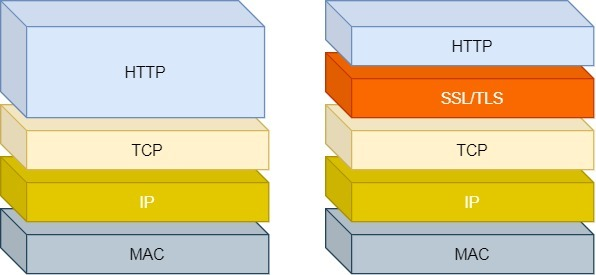
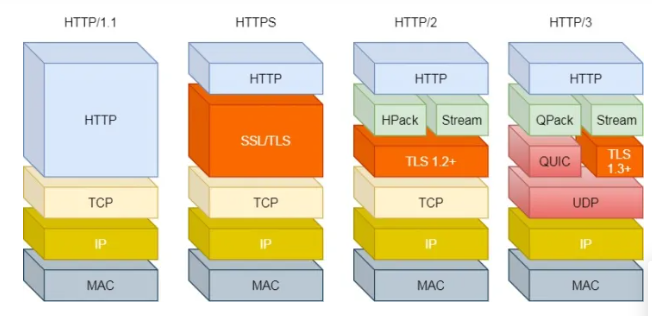

[TOC]

## HTTP 基础知识
### HTTP 状态码
+ 1xx

1xx 类状态码属于提示信息，是协议处理中的一种中间状态，实际用到的比较少。

+ 2xx

2xx 类状态码表示服务器成功处理了客户端的请求。

「200 OK」是最常见的成功状态码，表示一切正常。如果是非 HEAD 请求，服务器返回的响应头都会有 body 数据。

「204 No Content」也是常见的成功状态码，与 200 OK 基本相同，但响应头没有 body 数据。

「206 Partial Content」是应用于 HTTP 分块下载或断电续传，表示响应返回的 body 数据并不是资源的全部，而是其中的一部分，也是服务器处理成功的状态。

+ 3xx

3xx 类状态码表示客户端请求的资源发送了变动，需要客户端用新的 URL 重新发送请求获取资源，也就是重定向。

「301 Moved Permanently」表示永久重定向，说明请求的资源已经不存在了，需改用新的 URL 再次访问。

「302 Found」表示临时重定向，说明请求的资源还在，但暂时需要用另一个 URL 来访问。

301 和 302 都会在响应头里使用字段 Location，指明后续要跳转的 URL，浏览器会自动重定向新的 URL。

「304 Not Modified」不具有跳转的含义，表示资源未修改，重定向已存在的缓冲文件，也称缓存重定向，用于缓存控制。

+ 4xx

4xx 类状态码表示客户端发送的报文有误，服务器无法处理，也就是错误码的含义。

「400 Bad Request」表示客户端请求的报文有错误，但只是个笼统的错误。

「403 Forbidden」表示服务器禁止访问资源，并不是客户端的请求出错。

「404 Not Found」表示请求的资源在服务器上不存在或未找到，所以无法提供给客户端。

+ 5xx

5xx 类状态码表示客户端请求报文正确，但是服务器处理时内部发生了错误，属于服务器端的错误码。

「500 Internal Server Error」与 400 类型，是个笼统通用的错误码，服务器发生了什么错误，我们并不知道。

「501 Not Implemented」表示客户端请求的功能还不支持，类似“即将开业，敬请期待”的意思。

「502 Bad Gateway」通常是服务器作为网关或代理时返回的错误码，表示服务器自身工作正常，访问后端服务器发生了错误。

「503 Service Unavailable」表示服务器当前很忙，暂时无法响应服务器，类似“网络服务正忙，请稍后重试”的意思。

### HTTP 常见字段

## Get 与 POST
### GET 和 POST 有哪些区别?
Get 方法的含义是请求从服务器获取资源，这个资源可以是静态的文本、页面、图片视频等。

而 POST 方法则是相反操作，它向 URI 指定的资源提交数据，数据就放在报文的 body 里。

### GET 和 POST 方法都是安全和幂等的吗?
在 HTTP 协议里，所谓的「安全」是指请求方法不会「破坏」服务器上的资源。
所谓的「幂等」，意思是多次执行相同的操作，结果都是「相同」的。

GET 方法就是安全且幂等的，因为它是「只读」操作，无论操作多少次，服务器上的数据都是安全的，且每次的结果都是相同的。

POST 因为是「新增或提交数据」的操作，会修改服务器上的资源，所以是不安全的，且多次提交数据就会创建多个资源，所以不是幂等的。

## HTTP 特性
### 优点

1. 简单

HTTP 基本的报文格式就是 header + body，头部信息也是 key-value 简单文本的形式，易于理解，降低了学习和使用的门槛。

2. 灵活和易于扩展

HTTP协议里的各类请求方法、URI/URL、状态码、头字段等每个组成要求都没有被固定死，都允许开发人员自定义和扩充。

同时 HTTP 由于是工作在应用层，则它下层可以随意变化。

HTTPS 也就是在 HTTP 与 TCP 层之间增加了 SSL/TLS 安全传输层，HTTP/3 甚至把 TCP 层换成了基于 UDP 的 QUIC。

3. 应用广泛和跨平台

天然具有跨平台的优越性。

### 缺点

HTTP 协议里有优缺点一体的双刃剑，分别是「无状态、明文传输」，同时还有一大缺点「不安全」。

1. 无状态双刃剑

无状态的好处，因为服务器不会去记忆 HTTP 的状态，所以不需要额外的资源来记录状态信息，这能减轻服务器的负担，能够把更多的 CPU 和内存用来对外提供服务。

无状态的坏处，既然服务器没有记忆能力，它在完成有关联性的操作时会非常麻烦。

例如：登录->添加购物车->下单->结算->支付，这系列操作都要知道用户的身份才行。但服务器不知道这些请求是有关联的，每次都要问一遍身份信息。

这样每操作一次，都要验证信息，这样的购物体验还能愉快吗？别问，问就是酸爽！

2. 明文传输双刃剑

明文意味着在传输过程中的信息，是可方便阅读的，为我们调试工作带了极大的便利性。

但是，HTTP 的所有信息都暴露在了光天化日下，信息的内容都毫无隐私可言，很容易就能被窃取，如果里面有你的账号密码信息，那你号没了。

3. 不安全

通信使用明文（不加密），内容可能会被窃听。比如，账号信息容易泄漏。
不验证通信方的身份，因此有可能遭遇伪装。比如，访问假的淘宝、拼多多，那你钱没了。
无法证明报文的完整性，所以有可能已遭篡改。比如，网页上植入垃圾广告，视觉污染，眼没了。
HTTP 的安全问题，可以用 HTTPS 的方式解决，也就是通过引入 SSL/TLS 层，使得在安全上达到了极致。

### session cookie application
Session是一种保存用户状态的机制，保存在服务器中。当客户端请求服务器时，如果服务器需要记录下来该用户的状态，则为其创建Session并生成相对应的SessionID，保存该用户状态，并把本次响应中的SessionID返回给客户端保存；如果服务器中已经有该用户的状态，则按照客户端的SessionID把该Session状态检索出。

Cookie是一小段的文本信息，保存在客户端。当客户端请求服务器时，如果服务器需要记录该客户端的状态，则可以在向客户端响应response中向客户端浏览器发送一个Cookie，从而客户端将Cookie保存起来。当浏览器再次请求该网站时，浏览器把自身的请求和Cookie一同发给服务器，服务器检查客户端的Cookie，用此方式来辨别客户端的状态。
服务器也可以根据需求修改Cookie的内容。

application 类似于系统的全局变量，保存在服务端。它在服务器启动时自动创建，在服务器停止时销毁。当 application 对象没有被销毁的时候，所有用户都可以享用该 application 对象。它的生命周期可以说是最长的。但是其应用程序初始化的参数是要在web.xml文件中进行设置的，通过标记配置应用程序初始化参数。也就是说同时再打开另一个浏览器，他们使用的都是同一个application对象。

## HTTPS
### HTTP 安全上有什么问题
+ 通信使用明文（不加密），内容可能会被窃听。比如，账号信息容易泄漏。
+ 不验证通信方的身份，因此有可能遭遇伪装。比如，访问假的淘宝、拼多多，那你钱没了。
+ 无法证明报文的完整性，所以有可能已遭篡改。比如，网页上植入垃圾广告，视觉污染，眼没了。

### HTTPS 是什么？

https 就是在 http 和 tcp 协议之间增加了一个 SSL 协议。

TLS 是在 SSL 基础上开发的协议，TLS 1.0 和SSL3.0 几乎没区别。

### HTTPS 是如何解决这些问题的

1. 混合加密

HTTPS 采用的是对称加密和非对称加密结合的「混合加密」方式：

在通信建立前采用非对称加密的方式交换「会话秘钥」，后续在通信过程中全部使用该「会话秘钥」对数据加密 --- 对称秘钥。

采用「混合加密」的方式的原因：
非对称加密使用两个密钥：公钥和私钥，公钥可以任意分发而私钥保密，解决了密钥交换问题，但速度慢。
对称加密只使用一个密钥，运算速度快，但密钥必须保密，无法做到安全的密钥交换。

2. 摘要算法

摘要算法用来实现完整性，能够为数据生成独一无二的「指纹」，用于校验数据的完整性，解决了篡改的风险。

客户端在发送明文之前会通过摘要算法算出明文的「指纹」，发送的时候把「指纹 + 明文」一同 加密成密文后，发送给服务器。服务器解密后，用相同的摘要算法算出发送过来的明文，通过比较客户端携带的「指纹」和当前算出的「指纹」做比较，若「指纹」相同，说明数据是完整的。

3. 数字证书

客户端先向服务器端索要公钥，然后用公钥加密信息，服务器收到密文后，用自己的私钥解密。

这就存在问题，如何保证公钥不被篡改和信任度？

利用 CA 机构提供的数字证书。数字证书包括服务器公钥 + 数字签名，然后用 CA 机构私钥加密。客户端获取到数字证书后，利用 CA 机构公钥解密和验签。CA 机构的证书，一般已经内置在浏览器里了。

### HTTPS 是如何建立连接的

## HTTP 协议的演变
### HTTP/1.1相比HTTP/1.0提高了什么性能?
早期 HTTP/1.0 性能上的一个很大的问题，那就是每发起一个请求，都要新建一次 TCP 连接（三次握手），而且是串行请求，做了无谓的 TCP 连接建立和断开，增加了通信开销。

+ 长连接

为了解决上述 TCP 连接问题，HTTP/1.1 提出了长连接的通信方式，也叫持久连接。这种方式的好处在于减少了 TCP 连接的重复建立和断开所造成的额外开销，减轻了服务器端的负载。

+ 管道传输

HTTP/1.1 采用了长连接的方式，这使得管道（pipeline）网络传输成为了可能。

即可在同一个 TCP 连接里面，客户端可以发起多个请求，只要第一个请求发出去了，不必等其回来，就可以发第二个请求出去，可以减少整体的响应时间。

但是服务器还是按照顺序，先回应 A 请求，完成后再回应 B 请求。要是 前面的回应特别慢，后面就会有许多请求排队等着。这称为「队头堵塞」。

### HTTP/2针对 HTTP/1.1做了哪些优化?
+ 头部压缩

HTTP/2 会压缩头（Header）如果你同时发出多个请求，他们的头是一样的或是相似的，那么，协议会帮你消除重复的。

这就是所谓的 HPACK 算法：在客户端和服务器同时维护一张头信息表，所有字段都会存入这个表，生成一个索引号，以后就不发送同样字段了，只发送索引号，这样就提高速度了。

+ 二进制格式

HTTP/2 不再像 HTTP/1.1 里的纯文本形式的报文，而是头部类似 TCP 这样的。

+ 数据流

HTTP/2 的数据包不是按顺序发送的，同一个连接里面连续的数据包，可能属于不同的回应。因此，必须要对数据包做标记，指出它属于哪个回应。

每个请求或回应的所有数据包，称为一个数据流（Stream）。每个数据流都标记着一个独一无二的编号，其中规定客户端发出的数据流编号为奇数， 服务器发出的数据流编号为偶数。客户端还可以指定数据流的优先级。优先级高的请求，服务器就先响应该请求。

4. 多路复用

HTTP/2 是可以在一个连接中并发多个请求或回应，而不用按照顺序一一对应。

移除了 HTTP/1.1 中的串行请求，不需要排队等待，也就不会再出现「队头阻塞」问题，降低了延迟，大幅度提高了连接的利用率。

举例来说，在一个 TCP 连接里，服务器收到了客户端 A 和 B 的两个请求，如果发现 A 处理过程非常耗时，于是就回应 A 请求已经处理好的部分，接着回应 B 请求，完成后，再回应 A 请求剩下的部分。

5. 服务器推送

HTTP/2 还在一定程度上改善了传统的「请求 - 应答」工作模式，服务不再是被动地响应，也可以主动向客户端发送消息。

举例来说，在浏览器刚请求 HTML 的时候，就提前把可能会用到的 JS、CSS 文件等静态资源主动发给客户端，减少延时的等待，也就是服务器推送（Server Push，也叫 Cache Push）。

### HTTP/2有哪些缺陷?HTTP3做了哪些优化?

HTTP/2 主要的问题在于，多个 HTTP 请求在复用一个 TCP 连接，下层的 TCP 协议是不知道有多少个 HTTP 请求的。所以一旦发生了丢包现象，就会触发 TCP 的重传机制，这样在一个 TCP 连接中的所有的 HTTP 请求都必须等待这个丢了的包被重传回来。

这都是基于 TCP 传输层的问题，所以 HTTP/3 把 HTTP 下层的 TCP 协议改成了 UDP, 所以不会出现 HTTP/1.1 的队头阻塞 和 HTTP/2 的一个丢包全部重传问题。

大家都知道 UDP 是不可靠传输的，但基于 UDP 的 QUIC 协议可以实现类似 TCP 的可靠性传输。

QUIC 有自己的一套机制可以保证传输的可靠性的。当某个流发生丢包时，只会阻塞这个流，其他流不会受到影响。

TL3 升级成了最新的 1.3 版本，头部压缩算法也升级成了 QPack。

HTTPS 要建立一个连接，要花费 6 次交互，先是建立三次握手，然后是 TLS/1.3 的三次握手。QUIC 直接把以往的 TCP 和 TLS/1.3 的 6 次交互合并成了 3 次，减少了交互次数。

所以， QUIC 是一个在 UDP 之上的伪 TCP + TLS + HTTP/2 的多路复用的协议。

QUIC 是新协议，对于很多网络设备，根本不知道什么是 QUIC，只会当做 UDP，这样会出现新的问题。所以 HTTP/3 现在普及的进度非常的缓慢，不知道未来 UDP 是否能够逆袭 TCP。

