[TOC]


## 网络是怎么连接的
从在浏览器中输入网址，到屏幕上显示出网页的内容的主要过程。

+ 输入网址
+ 浏览器对 url 进行解析，生成 HTTP 请求信息
+ 获取域名对应的 IP 地址 --- DNS 协议
	+ 给域名地址查询消息加上 UDP 首部、IP 首部（源地址、DNS服务器地址）、以太网帧首部（源mac，目的mac）
	+ 目的 mac 如何确定？如果 DNS 服务器和主机在同一子网，目的就是 DNS 服务器，否则就是网关
	+ 发送 ARP 请求查询 mac 地址
	+ 主机收到回复，获取到目的 mac 地址
	+ DNS 请求发送到网关后，网关查询路由表确定下一跳地址进行转发
	+ DNS 服务器收到查询请求后，递归查找，并把结果返回
+ 和 web 服务器建立 TCP 连接
	+ 发送 syn
		+ 内网地址和公网地址的转换
	+ 收到 syn，ack
	+ 发送 ack
+ 发送 HTTP 消息给 web 服务器
+ web 服务器解析请求，并回复给浏览器
+ 浏览器解析显示出来
+ 如果连接不需要了，就通过四次挥手断开


## 传输层
### TCP
目的：可靠传输、流量控制、拥塞控制、差错控制

+ 解决方案： 

可靠传输：五元组，序号和ack，乱序重排，丢弃重复包，超时重传
流量控制：采用滑动窗口，即告诉发送方我最多能接收多少数据
拥塞控制：
差错控制：校验和

#### TCP首部

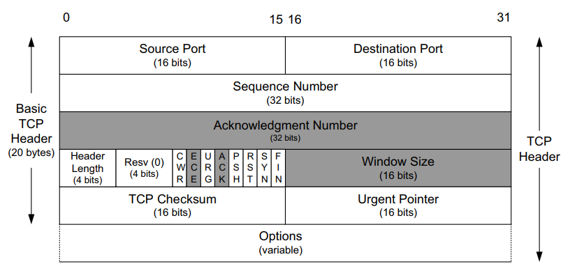

端口：The 4-tuple (consisting of the client IP address, client port number, server IP address, and server port number)  uniquely identifies each TCP connection in an internet.

序号：所有发送数据中的第 X 字节；每个连接的 ISN 不同，同时TCP 会选择一个最佳的大小，一般保证 IP 层不会因为太大而分片。

ACK：告诉发送方，下一次期望收到的 seq。这个 seq 等于已经收到的字节数 + 1；SYN 和 FIN 包也会消耗一个序号，ACK 包不消耗序号；连接建立以后 ACK 位一般总是1；

头部长度：取值1～15，代表20字节 ～ 60字节；

URG: 基本没人用；
ACK: The acknowledgment number is valid.
PSH: 基本没用；
RST: Reset the connection.
SYN: Synchronize sequence numbers to initiate a connection
FIN: The sender is finished sending data.

窗口：告诉对端最大还能接收多少数据；
校验和：对整个 segment 进行计算校验；

options: 
MSS: 告知另一端期望收到的最大 segment 的大小；
SACK-Permitted：support SACK，握手时协商;
SACK: SACK block (out-of-order data received)，告诉发送方；
window scale: 现有窗口大小乘以一定倍数，协议栈自己决定，在握手时确定；

timestamp: 
作用一：计算RTT；
作用二：防止序号号回绕，32bits 序列号只能支持1GB数据，在高速网络中序列号在短时间内会重复；
作用二：利用该时间戳可以使用time_wait 中的端口；
timestamp（4B） + timestamp echo(4B) 构成；
发送方在timestamp中写入发送时间st1；
接收方回复时在timestamp中写入回复时间rt1，在timestamp echo 中写入st1。


data: 可选，比如：握手包就没有数据；

#### 可靠传输

五元组：用于区分不同的连接；

序号：用序号来区分不同的包。SYN包中设置初始序号，初始序号是半随机的以便每个相同五元组连接的ISN不同，尽可能降低SEQ重叠(另一个连接的包，其seq在本连接窗口范围内）的风险；对于可靠性要求更高的应用程序，需要在应用层自行检查文件完整性。

ACK：收到数据，发送ACK，但ACK会推迟一小会(200ms)发送，而且采用的是累积ACK；这种方式增加了 ACK 的健壮性，前一个ACK丢了，后一个仍然可以确认之前的 segment；

重传：TCP有两种不同的机制来实现数据重传，一种是基于超时时间，另一种是基于 ACK 提供的信息（快重传）。第二种方法通常比第一种更高效。

超时重传时间：不是确定值，因为网络环境是不断变化的，一般通过估计RTT时间来得出。


乱序处理：依赖序号。

IP 层协议不保证数据包能够按序到达。乱序可能在正向和反向发生。

如果重新排序发生在反向（ACK）上，则导致 sender 收到显著向前移动的ACK，随后是一些明显旧的冗余ACK被丢弃。这可能导致TCP发送模式中不想要的突发行为（瞬间高速发送），并且由于TCP拥塞控制的行为，无法充分利用可用的网络带宽。

如果重排序在正向上发生，TCP可能会很难区分这种情况与数据包丢失。丢包和重排序都会导致接收方收到无序数据包，从而在预期的下一个数据包和到目前为止接收到的其他数据包之间创建空隙。当重新排序适度时（例如两个相邻的数据包交换顺序），可以比较快地处理该情况。当重新排序更加严重时，TCP可能会被欺骗，认为数据已经丢失，即使数据并没有丢失。这可能会导致虚假重传，主要来自快速重传算法。

去重：依赖序号。尽管很少见，IP协议有可能传递同一个数据包多次。这可能导致虚假的快速重传。

以上，就是实现可靠传输的基本方案，其他功能都是在这个基础上的优化；

#### 流量控制 

最简单的一个模型是“发送---等待收到ACK---继续发送”，但是这种模型效率非常低，吞吐量和RTT成反比。提升性能的一个方法，就是同时发送多个包，滑动窗口。

如果接收端相比发送端太慢了，怎么办呢？采用可变窗口进行流量控制 + 接收端通知发送端调整窗口大小。

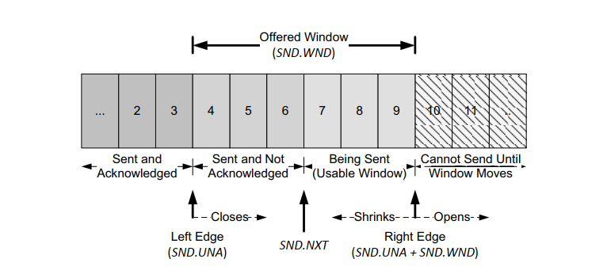

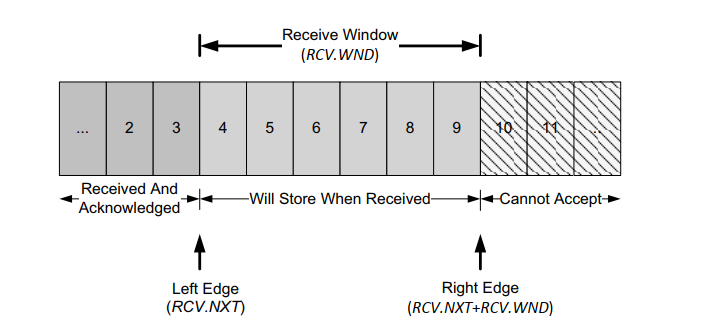

每个 TCP segment 都包含ACK号和窗口 advertisement，因此每当有传入 segment 到达时，TCP 发送方根据这两个值调整窗口结构。
接收缓冲区范围内任何序列号对应的字节均被接受。
由于TCP的累计ACK结构，只有在分段直接填充到左侧窗口边缘时，接收方生成的ACK号才能被推进。
使用选择性ACK，其他窗口内的分段可以使用TCP SACK选项进行确认，但最终只有在连续于左侧窗口边缘的数据到达时，ACK号本身才会被推进。

当接收方的广告窗口变为零时，发送方将被阻止传输数据，直到窗口再次变为非零。
当接收方再次有可用空间时，它会向发送方提供一个窗口更新。由于此类更新它们是“纯ACK”的形式，因此可能丢失。
为了防止出现这种死锁形式，发送方使用持久计时器定期查询接收方，以查看窗口大小是否增加。RFC [RFC1122]建议第一个探测应在一个RTO之后进行，随后的探测应在指数间隔。


窗口大小与 socket 的缓冲区大小有关，包括：系统的 socket 缓冲区（tcp、udp），和 tcp 自动调整缓冲区：
```
net.core.rmem_max = 131071
net.core.wmem_max = 131071
net.core.rmem_default = 110592
net.core.wmem_default = 110592

// 全局默认值,适用于 TCP/UDP/其他协议
// 每个 socket 默认缓冲区大小
net.core.rmem_default
net.core.wmem_default

// 每个 socket 最大的缓冲区大小，适用于 TCP/UDP/其他协议
net.core.rmem_max
net.core.wmem_max

// TCP 专用参数
// 格式：min default max（3个值，单位字节）
net.ipv4.tcp_rmem
net.ipv4.tcp_wmem

min：最小缓冲区（即使内存紧张也会保证）
default：初始缓冲区大小（覆盖 net.core.rmem_default, wmem_default）
max：自动调整的最大值（不可超过 net.core.rmem_max, wmem_max）

内核自动优化：根据负载动态调整（需开启 tcp_moderate_rcvbuf）

// 全局 TCP 内存限制（所有 TCP Socket 共享）
// 格式：low pressure high（3个值，单位页数）
net.ipv4.tcp_mem

low：低于此值时不触发内存压力。

pressure：开始根据负载缩减缓冲区。

high：拒绝新分配，直到内存低于 low。

// 全局 UDP 内存限制
net.ipv4.udp_mem


```

udp 由于没有流量控制，所以没有必要自动调整。
tcp 自动调整的，对于高带宽 - 高延迟的网络，过小的缓冲区会严重影响带宽利用率：
```
net.ipv4.tcp_rmem = 4096 87380 174760
net.ipv4.tcp_wmem = 4096 16384 131072
```

窗口大小与缓冲区的关系：
```
net.ipv4.tcp_adv_win_scale ： 默认为1

TCP 窗口大小 = (接收端的缓冲区大小) * 2^tcp_adv_win_scale
```

+ Silly Window Syndrome (SWS)

连接中交换的是小的 segment 而不是 MSS[RFC0813]，这会导致不可取的低效率，因为每个 segment 都具有相对较高的开销——与首部中的字节数相比，其中包含的数据字节数较少。

原因：可能由TCP连接的任一端引起：接收方可以 advertise 小窗口（而不是等待更大的窗口），发送方可以传输小 segment（而不是等待以发送更大的 segment）。

解决方案：
接收方：尽量避免发送小窗口的 advertisement。[RFC1122]中指定的接收算法规定，在窗口能够增大之前（可以为0），不 advertise 更大窗口的分段。窗口的增大可以通过以下两种方式之一实现：一个完整大小的分段（即接收MSS）或接收缓冲区空间的一半，以较小者为准。

发送方：尽量避免在收到小窗口 advertisement 时，发送小分段。a. 可以发送一个 MSS 的分段; b. TCP可以发送另一端在此连接上曾经广告过的最大窗口大小的至少一半。


#### 重传机制
+ 超时重传 

二进制指数退避，a binary exponential backoff,重传间隔分别在 0.2,0.4,0.8 ... ，从初始到最后失败需要经历 15min+。

`net.ipv4.tcp_retries2` 默认为15，对应大约 13-30min，取决于 RTO；

`net.ipv4.tcp_syn_retries` 默认为5，对应大约 180s；

+ 经典方法：
```
SRTT ← α(SRTT) + (1 − α) RTT
RTO = min(upperbound, max(lowerbound,(SRTT)β))
α 建议取 0.8～0.9
```
对于RTT相对稳定的分布来说，这是足够的。然而，在TCP在RTT高度变化的网络上运行时，它的性能并不好。指定的计时器无法跟上RTT的大幅波动（特别是当实际 RTT 远大于预期时会导致不必要的重传）,当网络已经负载较重时，不必要的重传会增加网络负载。

+ 标准方法Jacobson：

为解决这个问题，分配 RTO 的方法被改进以适应更大范围的RTT变化。这可以通过除了估算平均值外，还跟踪估算RTT测量的可变性来实现。使用了平滑的RTT和平滑的偏差
```
初始化：初始化EstimatedRTT和Deviation，例如，EstimatedRTT可以初始化为3秒，Deviation可以初始化为1秒；

计算数据包的 RTT；

更新EstimatedRTT：

EstimatedRTT = (1 - α) * EstimatedRTT + α * SampleRTT

其中，α是一个平滑因子，通常取值较小，例如0.125。SampleRTT是每次收到确认报文的 RTT；

更新Deviation：

Deviation = (1 - β) * Deviation + β * |SampleRTT - EstimatedRTT|

其中，β是一个衰减因子，比如取0.25，这个值越大越能快速响应 RTT 的波动；

这里系数的取值都是2的幂次，是为了避免乘除法；

计算RTO时间：

RTO = EstimatedRTT + 4 * Deviation

最后考虑计算机的时钟粒度：

RTO = max(EstimatedRTT + max(G, 4(Deviation)), 1000)
G is the timer granularity
```

在论文[KP87]中，规定当超时和重传发生时，当最终收到针对重传数据的确认时，我们不能更新RTT估算器。因为这时候无法确定这个 ACK 是针对原始包还是重传包的。

采用对 RTO 应用退避因子，每次后续重传计时器过期时将其加倍，直到收到未重传的segment的 ack 为止。此时，退避因子被设置回1（即二进制指数退避被取消），并且重传计时器返回其正常值。


+ Linux 方法：

基于Jacobson的算法，并做了一些改进。

RTO 永远不会低于 200ms。

TCP认为基于超时重传是一个相当重要的事件；当它发生时，它会非常谨慎地反应，通过快速减少发送数据率来降低数据发送到网络的速度。它通过以下两种方式实现这一点：第一种方式是基于拥塞控制程序减少发送窗口大小；另一种方式是增加退避因子。

+ 快速重传

快速重传[RFC5681]是一种TCP过程，可以根据接收方的反馈引发数据包重传，而不需要等待重传计时器到期。因此，往往比基于计时器的重传更快捷高效。快速重传，是基于 Dup ACK 来判断。


对接收方：当乱序数据到达时立即发送重复 ACK，且不会被延迟。这样做的原因是让发送方知道一个分节已经以乱序方式接收，并指示期望的序列号（即空隙在哪里）。当使用 SACK 时，这些重复 ACK 通常也包含 SACK 块，可以提供有关多个空洞的信息。

对发送方：收到的重复 ACK（带有或不带有 SACK 块）是数据包丢失的潜在指标。当发送方接收到至少 dupthresh 个重复ACK时，它会重新传输一个或多个(有SACK）似乎丢失的数据包，而不必等待重传计时器超时。它还可以发送尚未发送的其他数据。这就是快速重传算法的精髓。通过重复ACK的存在推断出的分组丢失被认为与网络拥塞有关，并且在快速重传期间调用拥塞控制程序。如果没有SACK，通常最多只会重新传输一个分段，直到收到可接受的ACK为止。

之所以要等待 dupthresh 是因为在网络上乱序是常见的。

+ NewReno 算法（快速重传 + 无 SACK + 额外的重传）

第一次重传时，重传的序号小于已经发出去的序号（恢复点），在达到恢复点之前收到的ACK成为 partial ACK。当收到 partial ack 时，会马上发送可能丢失的 segment。

由于没有使用SACK，发送方每个往返时间最多填补一个接收方的空洞。

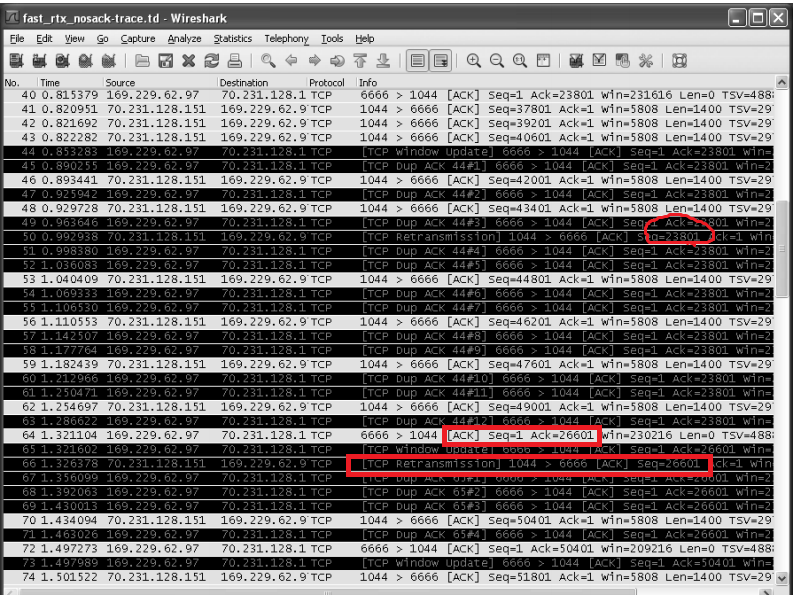


+ SACK 

当使用SACK选项时，SACK块包含有关接收方处于乱序状态的数据的信息。每个SACK块包含两个32位序列号，表示接收到的分段中包含的序列号范围。指定n个块的SACK选项长度为8n + 2字节，因此可用于保存TCP选项的40字节最多可以指定四个块。预计SACK通常与TSOPT一起使用，TSOPT需要额外的10字节（加上2字节填充），这意味着SACK通常只能每个ACK包含三个块。

使用三个不同的块，最多可以向发送方报告三个空洞。如果没有被拥塞控制所限制，可以在一个往返时间内填补所有三个空洞。

由于 SACK 可能会丢失，所以会出现重复的 SACK 块。举个例子，假设有一个TCP连接，在第一次传输数据时，第一个SACK块记录了1到100字节的数据已经被接收。当接收方向发送方发送SACK选项来确认接收到的数据时，这个SACK块会被包含在其中。但是，如果这个SACK选项因为某些原因丢失了，那么接收方可以在之后的SACK选项中再次包含相同的SACK块，以确保通信的可靠性。

当SACK-capable发送方有机会进行重传时（通常是因为它收到了SACK或看到多个重复的ACK），它可以选择发送新数据还是重传旧数据。 根据 SACK 信息发送方可以推断出需要重新传输哪些分段，最简单的方法是首先填充接收方的空洞，然后根据拥塞控制程序的规定，如果允许继续发送更多的新数据[RFC3517]，则可以继续发送。这是最常见的方法。


+ 重新封包

当TCP超时并进行重传时，它不必重传完全相同的数据段。相反，TCP允许进行重新封包（repacketization），发送一个更大的数据段，可以提高性能。

TCP重传一个与原始数据段大小不同的数据段的能力，提供了另一种解决重传歧义问题的方式。这是STODER [TZZ05]的思想基础，使用重新封包来检测虚假的超时。


#### 拥塞控制 

改变窗口大小可以解决接收端慢的问题，那么网络带宽如果不够而发送太快，总是丢包，这种问题怎么解决？这就是拥塞控制要解决的问题。

网络拥塞无法避免，但确实有靠谱的策略；

sender 可以发送多少数据，由2个变量决定：发送窗口、拥塞窗口。
发送窗口：是对端告诉你的；
拥塞窗口：是本地维护的一个虚拟窗口，动态变化；

1. 拥塞窗口的维护机制：

拥塞窗口初始值比较小，RFC 建议2个、3个或4个，具体试 MSS 而定；

首先是慢启动过程，由于这个过程拥塞可能性低，所以窗口增加得可以快一点。RFC 建议每收到 n 个确认，窗口增加 n 个MSS。2 - 4 - 8 ... 

然后是拥塞避免阶段，窗口到达临界窗口，这时可能会拥塞了，窗口要增加得慢一点，慢慢试探。RFC建议，每一个RTT时间增加1个MSS。临界值，或者取之前的拥塞点，或者参考最大接收窗口。

随着拥塞窗口继续增大，如果发生了超时重传，说明碰到拥塞了。RFC 建议把拥塞窗口降到 1个 MSS，重新开始慢启动过程，临界窗口设置为发生拥塞时未确认的数据量的一半，同时不小于2个MSS。

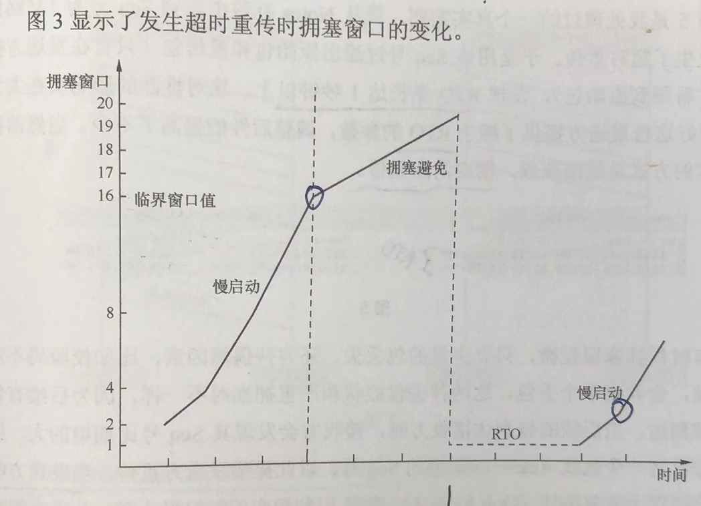

2. 快重传时拥塞窗口的变化

快重传，虽然丢了某个包，但后续的包还是可以收到的，说明拥塞不严重，所以拥塞窗口不用降到太低。

RFC 建议把拥塞窗口设置为临界窗口加3个MSS，继续保留在拥塞避免阶段，临界窗口设置为发生拥塞时未确认的数据量的一半，同时不小于2个MSS。

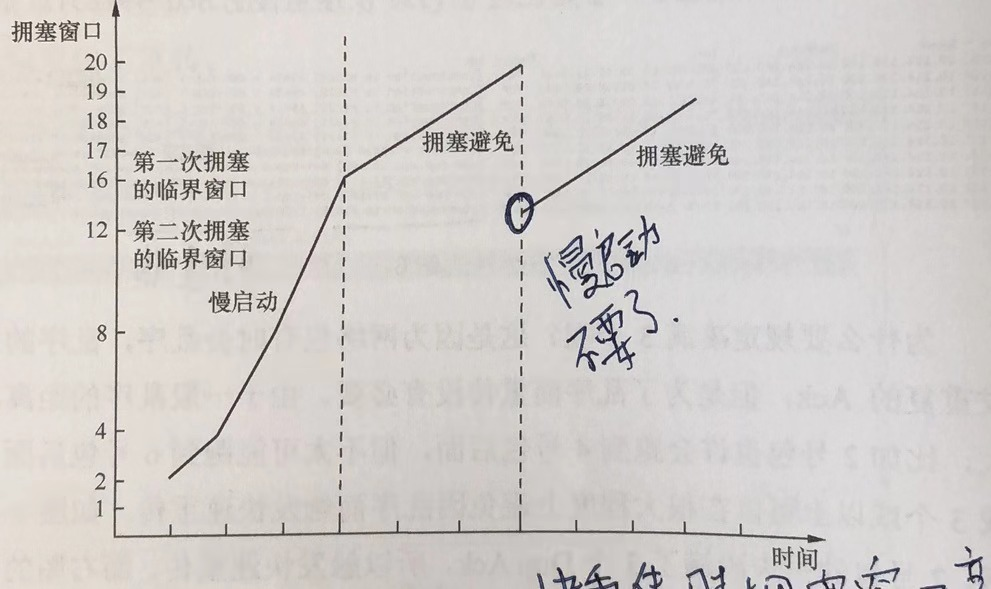

3. 超时重传为什么对性能影响大？

一是，需要等待一个 RTO 才能发数据，浪费了时间；
二是，超时重传以后，拥塞窗口减少到1个MSS，重新开始慢启动；

4. 为什么平时感觉不到拥塞呢？

应用环境中的发送速度，就没有达到拥塞点，或者持续时间不长。

看网页视频卡顿，就是拥塞了。

5. 如何提升程序带宽？

如果网络没有拥塞，发送速度越快越好，所以要增大自身的接收窗口；

如果经常发生拥塞，那么限制自身的接收窗口，反而能提高性能，即使万分之一的超时重传对性能影响也很大；

丢包对小文件的影响远大于大文件，因为小文件很可能不会触发3次 DUP ACK，只能等待超时重传；

要尽量避免超时重传，快重传和SACK 有利于传输性能；

#### TCP状态转换
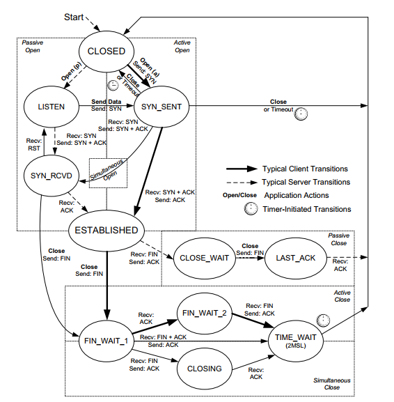

#### 连接建立
为什么说 TCP 是有连接的？
"有连接"和"无连接"从网络协议的角度来看，指的是是否需要在数据传输之前进行握手操作以及在传输过程中是否维护连接状态。TCP需要建立连接并维护连接状态，而UDP则不需要这些操作。

(1) SYN 和 FIN 为什么要消耗一个序列号

因为需要对端确认

(2) 半连接队列与全连接队列

服务端的连接，会处于两种状态： SYN_RCVD 和 Established（完成三次握手）;

服务端在 listen 的时候确定好了半连接队列和全连接队列长度;

在开启 tcp_syncookies 的情况下，半连接队列满了，syn 不会被丢弃。
在全连接队列满了，丢弃握手包。全连接队列长度，listen 时传入的 `backlog` 和 `net.core.somaxconn` 中的最小值;

当服务端通过 accept 处理了连接，该连接将被移出套接字的全连接队列并被分配给应用程序处理。

(3) TCP Fast Open
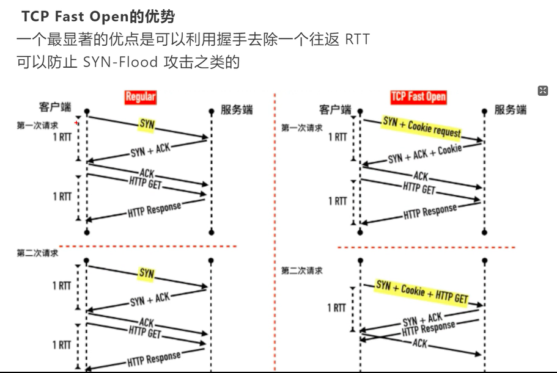

#### 连接关闭

2MSL 的作用：如果ACK丢失，对端会重发FIN，所以需要等待一段时间；在这段时间内，是无法建立一个同样五元组的新连接的，如此，一个新连接建立以后，旧连接的 segment 不会被误认为是新连接的，因为2MSL保证了旧连接的 segment 消亡了；

对于客户端，如果快速新建大量连接，可能由于临时端口不够用，而不得不等待其他连接结束；

对于服务端，一般是被动关闭，不会涉及2MSL；但如果服务端重启，就会因为这个 2MSL 失败；

通过 SO_REUSEADDR 这个选项来使用处于 TIME_WAIT 状态中的 (ip,port)，因为根据(timestamp, seq)的组合能基本保证不会混淆新连接和旧连接的segment；

客户端主动关闭，协议栈会设置一个超时定时器，避免状态永久停留在 FIN_WAIT_2 状态，net.ipv4.tcp_fin_timeout;

针对服务端半打开的场景，（连接建立以后，客户端重启了，服务端不知道，一直维持连接），可以采用 keepalive 来解决；

#### 保活

保活的目的：
+ 了解对方的状态。服务端进程往往会给客户端分配资源，它希望知道客户端主机是否崩溃或离线，所以使用TCP保活来检测死掉的客户端。
+ 在现实网络环境中，保持一定的数据量。客户端与服务端之间可能由于长时间空闲，导致中间的网络设备(NAT、firewall)把连接状态给删除了。

保活的缺点：

可以导致本来正常的连接由于中间设备临时性故障而断开。例如，如果在中间路由器崩溃和重新启动期间发送保活探测，TCP会错误地认为对端已经崩溃。

如果在连接上没有活动一段时间（称为保持活动时间），会向对端发送 Keepalive 探测。如果没有收到响应，探测将按照 保持活动间隔 周期性地重复，直到达到 保持活动探测次数。如果发生这种情况，对端将被认定为不可达，并且连接将被终止。

[RFC1122]规定，单个 Keepalive 探测的缺乏响应不能被视为连接已停止, 这就是前面提到的保持活动探测参数设置的原因。

发送 keepalive 保活，可能出现三种结果：
(1) 对方回复，这时会在下个保活间隔时间到了再次发送保活；
(2) 对方进程重启了，回复 RST，连接断开；
(3) 对方没有回复，可能进程崩溃，有可能网络故障，这时会在下个间隔重新发送，直到达到保活探测次数，连接断开。

默认值：
net.ipv4.tcp_keepalive_time = 7200,  // 空闲 7200 发保活
net.ipv4.tcp_keepalive_intvl = 75,   // 无法收到保活应答，重复发送间隔
net.ipv4.tcp_keepalive_probes = 9    // 探测最大次数

### UDP

UDP 包数据部分的理论最大长度：65535 - 20 - 8；

在 Linux 上，收到的 UDP 包超过了程序的接收空间大小，会进行截断，即只收前面一部分、后面超过的部分就不收了；

一般来讲，基于 UDP 的应用程序会采用保守的方法来避免 IP 分片。在实践中，很多基于 UDP 的应用程序会选择使用 512 字节来存放数据。 

## 网络层
### IPV4 地址
0.0.0.0/32  DHCP包中作为源地址
10.11.12.0/24 全0代表子网
10.11.12.255/24 全1代表子网的广播地址  

内外网地址转换，目的是什么？ 节约利用IP，防止从互联网非法入侵内网

### IPV6 地址
+ IPV6 地址表示方式

IPv6地址由两部分组成：地址前缀与接口标识。

地址前缀的表示方式为：IPv6地址/前缀长度。

+ IPv6支持有状态地址配置和无状态地址配置：

有状态地址配置：是指从服务器（如DHCP服务器）获取IPv6地址及相关信息；

无状态地址配置：是指主机根据自己的链路层地址及路由器发布的前缀信息自动配置IPv6地址及相关信息。

同时，主机也可根据自己的链路层地址及默认前缀（FE80::/10）形成链路本地地址，实现与本链路上其他主机的通信

+ 地址分类

单播地址：用来唯一标识一个接口，类似于IPv4的单播地址。发送到单播地址的数据报文将被传送给此地址所标识的接口。

组播地址：用来标识一组接口（通常这组接口属于不同的节点），类似于IPv4的组播地址。所有监听该组播地址的接口都会接收到数据包。

任播地址：用来标识一组接口（通常这组接口属于不同的节点）。发送到任播地址的数据报文被传送给此地址所标识的一组接口中距离源节点最近（根据使用的路由协议进行度量）的一个接口。

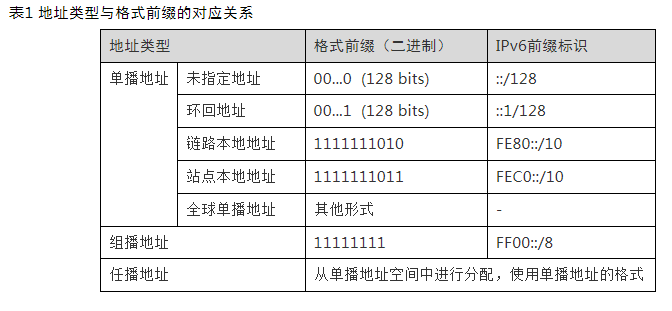

+ 单播地址 

全球单播地址：等同于IPv4公网地址，提供给网络服务提供商。这种类型的地址允许路由前缀的聚合，从而限制了全球路由表项的数量。


链路本地地址：当一个节点启动IPv6协议栈时，启动时节点的每个接口会自动配置一个链路本地地址。这种机制使得两个连接到同一链路的IPv6节点不需要做任何配置就可以通信。使用链路本地地址作为源或目的地址的数据报文不会被转发到其他链路上。

站点本地地址：用于站点内部通信，类似ipv4的私网ipv，目前已经被 fc00::/7 的唯一本地地址（ULA）替代。

环回地址：不能分配给任何物理接口,用来给自己发送IPv6报文。

未指定地址：地址“::”称为未指定地址，不能分配给任何节点。在节点获得有效的IPv6地址之前，可在发送的IPv6报文的源地址字段填入该地址，但不能作为IPv6报文中的目的地址。

+ 组播地址 

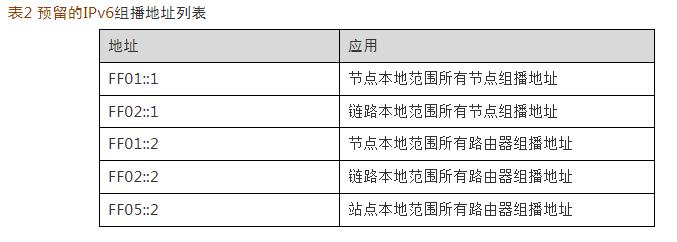

特殊的组播地址：被请求节点（Solicited-Node）地址。该地址主要用于获取同一链路上邻居节点的链路层地址及实现重复地址检测。每一个单播或任播IPv6地址都有一个对应的被请求节点地址。其格式为：

FF02:0:0:0:0:1:FFXX:XXXX

其中，FF02:0:0:0:0:1:FF为104位固定格式；XX:XXXX为单播或任播IPv6地址的后24位。

+ IEEE EUI-64格式的接口标识符

IPv6单播地址中的接口标识符用来标识链路上的一个唯一的接口。目前IPv6单播地址基本上都要求接口标识符为64位。IPv6地址中的接口标识符是64位，而MAC地址是48位，因此需要在MAC地址的中间位置（从高位开始的第24位后）插入十六进制数FFFE（1111111111111110）。为了确保这个从MAC地址得到的接口标识符是唯一的，还要将Universal/Local (U/L)位（从高位开始的第7位）设置为“1”。最后得到的这组数就作为EUI-64格式的接口标识符。

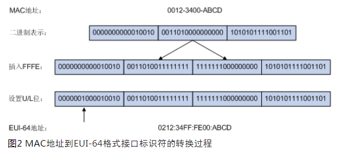


### ipv4 

+ 协议 

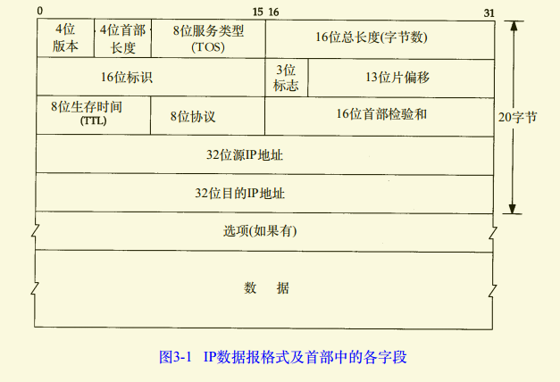
首部长度：一般是5（20字节），最长15（60字节）；
服务类型：
总长度：整个 IP 数据报的长度，最大 65535 字节；
标识：唯一标识同一个 IP 包，用于分片组包；
3位标志：DF 是否允许分片；MF：是否还有后续分片，最后一个分片为0，前面都是1；
片偏移：当前片的数据在 IP 包中的偏移，用于分片重组成一个完整的包，第一个片偏移为0，；
生存时间：代表可以经过多少个路由器，为0时丢弃，并发送 ICMP 报文通知源主机；
协议：；

### ICMP 
作用：用来传递差错报文或其他需要注意的信息；

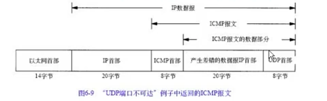

### ping
作用：检测主机是否可达；
原理：利用 ICMP 报文来检测；

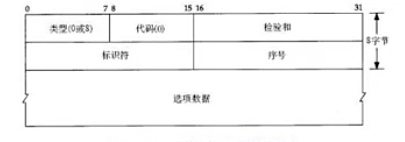
标识符：unix 系统上标识符是 pid，序号不断递增；


### 路由 

明细策略路由   --- 带有策略的路由
明细路由      --- 比如：目的路由
默认策略路由  --- 满足某个策略的默认网关
默认路由      --- 默认网关

### 广播和多播 


## 链路层

作用：面对不同的网络硬件和网络环境，实现数据的收发。
目标：能够充分利用硬件，提高带宽。
障碍：不同的网络硬件，不同的信号传播环境（有线、无线、信号噪声、信号衰减等），不同的网络组网方式。

网络包本质是电信号或光信号。
网卡接收到信号之后，把信号还原成二进制数字信息；网卡发送数据，刚好相反，先把数字信息转变成电信号，（光纤传输还要转换为光信号）。

所以，链路层是对网络硬件的封装，向上给 IP 层提供接口。

### 以太网协议

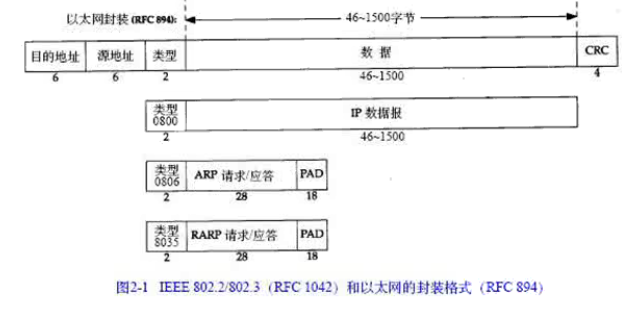

PAD: 以太网规定一个帧最少 64 字节，于是数据部分最少 46 字节，所以 ARP 需要补足。

### 环回口

+ 为什么叫环回口？

向这个接口输出数据，能够从这个接口再次收到数据，所以叫环回。

IP 输出函数 --- IP 输入队列 --- IP 输入函数

+ 哪些数据会被送到环回接口？

目的地址是环回地址、本地接口地址、广播地址和多播地址（会拷贝一份副本传给环回接口，因为主机本身是包括在广播、多播地址内的）


### ARP

作用：把 IP 地址转换成 6 字节的硬件地址。

+ ARP 高速缓存

为了提高转换效率，于是有了 ARP 高速缓存。在大多数情况下，ARP 缓存表的过期时间一般设置为5分钟左右，尽可能保证数据不会过时。当一个 ARP 缓存条目过期时，系统会自动将其从缓存表中删除，并在需要时重新发送 ARP 请求以获取最新的 MAC 地址。

何时更新 arp 缓存？
主机收到 arp 应答或者对本机的 arp 请求的时候。

通过 arp 命令可以操作高速缓存。

+ arp 协议

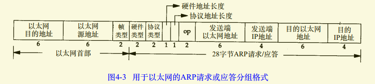

以太网目的地址：对于请求，全1的广播地址；对应答，是目的mac；
以太网源地址：sender 的 mac 地址；
帧类型：0x0806;
硬件类型：1，代表以太网地址类型；
协议类型：0x0800， 表示 IP 地址；
硬件地址长度：6；
协议地址长度：4；
op：请求，应答；
发送端以太网地址：同以太网源地址；
发送端ip地址：sender ip地址；
目的以太网地址：对请求是 0:0:0:0:0:0;对应答是目的mac；
目的ip地址：；


+ 免费 arp 请求：

特点：目的IP地址 = 发送端IP地址。

作用一、检测是否存在 IP 冲突，如果其他主机回复了此 ARP 请求，说明存在 IP 冲突；

作用二：更新其他主机的 arp 缓存；

+ arp_ignore: 决定是否回应 arp 请求。

0 - (默认值): 回应对所有本机 IP 地址的 arp 查询请求。

1 - 只回应对本网卡 IP 地址的 ARP 查询请求 。即 ethX 只回应对 ip(ethX) 的 arp 请求。

2 - 只回应对本网卡 IP 地址的 arp 请求，且源 IP 地址必须在同一子网。

4-7 - 保留未使用

8 - 不回应所有（本机地址）的arp查询

+ arp_announce: 如何选择 arp 请求的源 IP 地址。

0 - (默认) 使用任何本机地址进行ARP请求。ARP请求包中的源IP地址将使用与IP数据包中的 源IP 相同的本主机上的IP地址。

1 - 尽量避免使用不在该网卡子网段内的IP地址做为 arp 请求的源 IP 地址。此时会检查IP数据包中的源IP是否为所有网络接口上子网段内的ip之一。如果找到了一个网络接口的IP正好与IP数据包中的源IP在同一子网段，则使用该网络接口卡进行ARP请求。如果IP数据包中的源IP不属于各个网络接口上子网段内的ip，那么将采用级别2的方式来进行处理。

2 - 始终使用与目标IP地址对应的最佳本地IP地址作为ARP请求的源IP地址。在此模式下将忽略IP数据包的源IP地址并尝试选择能与目标IP地址通信的本机地址。

## 应用层协议
### HTTP
浏览器收到服务端回复的消息后，根据如下字段来解析消息：
+ content-type: 数据类型
+ charset ： 编码方式
+ content-encoding：压缩方式或编码技术


### DNS
+ 目标

实现域名和 IP 地址的转换。

+ 解决方案

DNS 服务器采用层级结构，解决了扩展性问题。如果是一台服务器保存全部信息，扩展就差。

DNS 服务器具有缓存功能，缓存了最近的查询结果，可以加快查询。
但是注册信息可能会变化导致缓存信息不正确，所以为了解决这个问题给缓存加了个有效期。

+ 递归查询

查询 www.baidu.com

首先查找电脑上的DNS缓存列表，如果有记录，那么直接返回对于IP地址，否则进行下一步；

查找电脑上的HOST文件的映射关系，如果有记录，那么返回对于IP地址，否则进行下一步；

查找本地DNS服务器（即中国电信、中国移动或中国联通），本地DNS服务器先查找自己的缓存记录，如果有记录，那么返回对于IP地址，否则本地DNS服务器向根域名服务器发生请求；

根域名服务器收到请求后，查看是.com顶级域名，于是返回.com顶级域名服务器的IP地址给到本地DNS服务器；

本地DNS服务器收到回复后，向.com顶级域名服务器发起请求；

.com顶级域名服务器收到请求后，查看是.baidu.com次级域名，于是返回.baidu.com次级域名服务器的IP地址给到DNS服务器；

本地DNS服务器收到回复后，向.baidu.com次级域名服务器发起请求；

.baidu.com次级域名服务器收到请求后，查看是自己管理的域名，于是查看域名和IP地址映射表，把www.baidu.com的IP地址返回给本地DNS服务器；

本地DNS服务器收到回复后，向电脑回复域名对应IP地址，并把记录写入本地DNS服务器的缓存里；

电脑收到回复后，使用IP地址访问网站，并把记录写入电脑DNS缓存中。


### SIP
+ 目标、作用

基于 IP 网络的多媒体会话，新建、修改、终止会话。一种轻量级的可扩展的请求/响应协议。

标准：RFC 3261, GB/T28181-2016

+ 优点

稳定性：该协议已经使用了多年，现在十分稳定。

速度：基于 UDP 的小型协议效率特别高。

灵活性：这个基于文本的协议十分容易扩展。

安全性：它提供像加密 (SSL、S/MIME) 和身份验证这样的功能。对 SIP 的扩展还提供其他安全性功能。

标准化：随着整个通信行业都在向 SIP 靠拢，SIP 已经讯速成为一种标准。其他技术可能具有 SIP 所没有的优势，但是它们没有得到全球范围内的采用。

+ 术语

UA(user agent) : SIP 逻辑终端实体，由 UAC(user agent client) 和 UAS(user agent server) 组成，UAC 负责发起呼叫，UAS 负责接收呼叫并作出响应。

UAS(用户代理服务器)：当接到 SIP 请求时联系用户，并代表用户返回响应。

proxy server(代理服务器)：把来自 UAC 的请求转到 UAS，并把 UAS 的响应消息转发回 UAC。

redirect server(重走向服务器)：逻辑实体，负责规划 SIP 呼叫路由。它将获得的呼叫下一跳地址信息告诉呼叫方，以便呼叫方根据此地址直接向下一跳发出请求，此后重定向服务器退出呼叫过程。

register server(注册服务器)：逻辑实体，具有接收注册请求，并将请求中携带的信息进行保存，并提供本域内位置服务的功能服务器。


+ SIP 消息

SIP 消息采用文本方式编码，包括请求消息与响应消息两类。

RFC 3261定义的请求消息有以下六种：
+ INVITE：请求消息用于邀请用户加入一个呼叫。
+ ACK：用于对请求消息的响应消息进行确认。
+ OPTIONS：用于请求协商能力信息。
+ BYE：用于释放已建立的呼叫。
+ CANCEL：用于释放尚未建立的呼叫。
+ REGISTER：用于向 SIP 注册服务器登记用户位置等信息。

SIP 响应消息用于对请求消息进行响应，指示呼叫或注册的成功或失败状态。响应消息的分类：
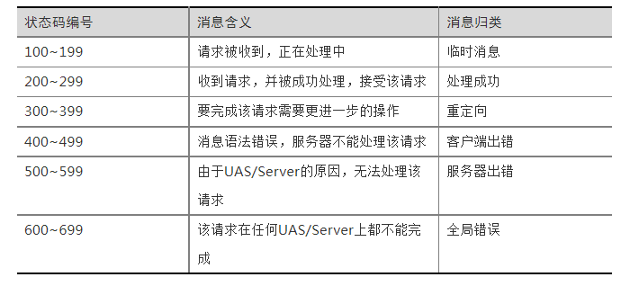
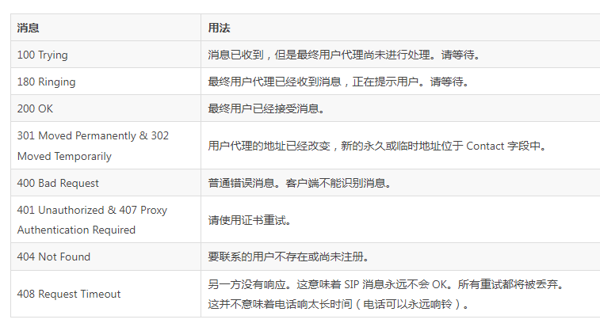


+ Via

Via 用于记录由有助于将响应路由回始发者的请求所采用的 SIP 路由。

Via头字段包含协议名称，版本号和传输(SIP / 2.0 / UDP，SIP / 2.0 / TCP等)，并且可以包含端口号和参数，例如接收的，rport，branch，maddr， b>和 ttl 。

生成请求的 UA 在 Via 头字段中记录其自己的地址。

转发请求的代理将 Via 头字段包含其自己的地址添加到 Via 头字段列表的顶部。

生成对请求的响应的代理或 UA 将请求中的所有 Via 报头字段按顺序复制到响应中，然后将响应发送到在顶部 Via 报头字段中指定的地址。

接收响应的代理检查顶部 Via 头字段并匹配其自身的地址；如果不匹配，则响应已被丢弃。匹配，则删除顶部 Via 头字段，并将响应转发到在下一个 Via 头字段中指定的地址。

如果 UA 或代理从与在顶部 Via 头字段中指定的地址不同的地址接收到请求，则将收到的标签添加到 Via 头字段。

分支参数通过 UA 和代理被添加到 Via 报头字段，其被计算为Request-URI 的哈希函数，以及 To，From，Call-ID 和 CSeq 数。

+ From

From 头字段表示请求的发起者。它是用于标识对话框的两个地址之一。

A From 头字段可以包含用于标识特定呼叫的标签。

它可以包含显示名称，在这种情况下，URI包含在< >;

它是必需的头。


+ tag

SIP tag 是一个随机字符串，长度至少为32个比特位。Call-ID, From tag, To tag 这个三元组构成 dialog 标识。

初始 INVITE 消息的To头域没有tag。主叫方必须在From头域中携带自己的tag，但在RFC2543规范中，这是可选的，遵行RFC2543的UA通常不会携带tag。除了100 Trying，其它所有应答消息都应该在To头域中携带Tag。

发送或接收包含 From tag 的应答消息时创建了一个早期dialog。然后，与200 OK应答中所返回的To tag合并，组成dialog标识符，后续这个Call-ID相关的所有请求都以这个三元组为标识。Tag不允许跨话务拷贝。由代理生成的任何应答都将由代理添加tag。由UA或代理生成的ACK将始终从应答消息复制tag内容写入ACK请求。

如果UAC收到的应答消息中包含不同的tag，这意味着这些应答来自不同的UAS，也就是INVITE存在分支。如何处理这种场景取决于UAC。比如说，UAC可以分别为每个UAS建立独立的媒体会话。这些dialog中，会包含相同的From, Call-ID甚至是Cseq，但To tag一定不同。UAC也可以挂断一些，只保留一个会话。

+ To

To 表示请求的最终收件人。UA生成的任何响应将包含此标头字段并添加标签。它是必需的头。

代理生成的任何响应必须在 To 头字段中添加标签。

To 头字段URI从不用于路由。

+ Call-ID

Call-ID 头字段在所有 SIP 请求和响应中是强制的。它用于唯一标识两个用户代理之间的呼叫。

+ CSeq

CSeq 头字段是每个请求中所需的头字段。通常，对于每个新请求，除了 CANCEL 和 ACK 请求，它增加1。

UAS 使用 CSeq 计数来确定失序请求或区分新请求(不同CSeq)或重传(相同CSeq)。

UAC 使用 CSeq 头字段以匹配对其请求的响应。

+ Contact

Contact头字段用于向其他用户传达关于请求发起者的地址。 一旦接收到联系人报头字段，URI可以被缓存并且用于在对话中路由未来的请求（可以跳过代理直接发到这个地址）。

+ Expires

Expires头字段用于指示请求或消息内容有效的时间间隔。

当存在于 INVITE 请求中时，UAC必须在该时间段内接收最终响应(非1xx)，或者INVITE请求被408请求超时响应自动取消。

一旦建立会话，来自原始INVITE中的Expires头字段的值没有效果 - 为此目的必须使用Session-Expires头字段。

如果存在于 REGISTER 请求中，如果用户配置信息中配置了sip-force-expires 具体值如100，那么超时等于100秒；如果用户配置信息中没配置该 expires 值，那么取 expires 值。

Expires也用于SUBSCRIBE请求中，以指示订阅持续时间。


+ Accept

Accept头字段用于在消息正文中指示可接受的消息Internet媒体类型。

如果不存在，则假定可接受的消息体格式为 application / sdp。

媒体类型列表可以使用 q 值参数设置首选项。

+ Accept-Encoding

Accept-Encoding 头字段用于指定可接受的消息体编码方案。如果不包括，则假设的编码将是 text / plain 。

使用 q 值参数可以设置首选项。如果所列出的方案都不能被UAC接受，则返回406不可接受的响应。


+ Record-Route

Record-Route头字段用于强制路由通过代理以用于两个UA之间的会话(对话)中的所有后续请求。

通常，Contact头字段的存在允许UA直接绕过初始请求中使用的代理链来发送消息。


+ Organization

组织头字段用于指示消息的发起者所属的组织。

它也可以由代理插入，因为消息从一个组织传递到另一个组织。

与所有SIP报头字段一样，它可以由代理用于做出路由决定，并且由UA用于进行呼叫筛选决定。

+ Retry-After

它用于指示资源或服务何时可以再次可用，以秒位单位。

在503服务不可用响应中，它指示服务器何时可用。

在404未找到，600 Busy Everywhere和603拒绝响应中，它指示被叫UA何时可以再次可用。


+ Subject

可选的Subject头字段用于指示媒体会话的主题。

+ Supported

Supported 头字段用于列出UA或服务器实现的一个或多个选项。它通常包含在对OPTIONS 请求的响应中。

如果未实现任何选项，则不包括头字段。

如果 UAC 列出了支持报头字段中的选项，代理或 UAS 可以在呼叫期间使用该选项。

如果必须使用或支持该选项，那么将使用 Require 头字段。

+ User-Agent

该报头字段用于传送关于发起请求的UA的信息。


### SDP 
+ 目的、作用

在多媒体会话中传达关于媒体流的信息，以帮助参与者加入或收集特定会话的信息。它传达会话的名称和目的，媒体，协议，编解码格式，定时和传输信息。

+ 会话描述参数

v = (protocol version)
o = (owner/creator and session identifier)
s = (session name)
i =* (session information)
u =* (URI of description)
e =* (email address)
p =* (phone number)
c =* (connection information - not required if included in all media)
b =* (bandwidth information)
z =* (time zone adjustments)
k =* (encryption key)
a =* (zero or more session attribute lines)
t =* (session start time/session stop time)

+ owner/creator 和会话标识

o =字段包含有关会话发起者和会话标识符的信息。此字段用于唯一标识会话。

该字段包含 - o =< username>< session-id>< version>< network-type>< address-type>

usernam：包含发起方的登录名或主机。

session-id：是用于确保唯一性的网络时间协议(NTP)时间戳或随机数。

version：是一个数字字段，对于会话的每个更改都会增加，也建议为NTP时间戳。

network-type：对于Internet，类型始终为IN。

address-type：IPv4或IPv6地址。


+ connection information 

c =字段包含有关介质连接的信息。

该字段包含 - c =< network-type>< address-type>< connection-address>

对于Internet， network-type 参数定义为IN。地址类型定义为IPv4地址的IP4和IPv6地址的IP6。

connection-address 是将发送媒体数据包的IP地址或主机，可以是多播或单播。

如果组播，则connection-address字段包含 -

connection-address = base-multicast-address / ttl / number-of-addresses

+ 媒体公告

可选的 m =媒体端口传输格式列表

媒体参数是音频，视频，文本，应用程序，消息，图像或控件。port参数包含端口号。
		
传输参数包含使用的传输协议或RTP配置文件。

格式列表包含有关介质的更多信息。通常，它包含在RTP音频视频简档中定义的媒体有效载荷类型。

+ 属性

可选的, a =字段包含前面的媒体会话的属性。 此字段可用于扩展SDP以提供有关介质的更多信息。 如果SDP用户没有完全理解，则可以忽略属性字段。 


## 网络设备
### 集线器

工作在网络接口层，会把收到的包从所有其他端口发送出去，从而把收到的包广播到整个网络中

### 交换机

交换机转发流程：

1. 当交换机收到一个数据帧时，会先对其进行物理层的处理，即检查 CRC 校验码是否正确，以确保数据的完整性。

2. 然后，交换机会将数据帧解包，并获取其中的源 MAC 地址和目的 MAC 地址。源 MAC 地址是发送方的 MAC 地址，而目的 MAC 地址则是接收方的 MAC 地址。

3. 接下来，交换机会查询自己的 MAC 地址表，看看是否已经有了目的 MAC 地址的记录。如果有记录，说明这个目的设备已经在交换机的某个端口上，那么交换机就会将这个数据包转发到与目的设备相应的端口上；如果没有记录，则交换机会将数据包广播到所有端口上（除了源端口），以便找到目的设备的位置。

4. 在转发数据包时，交换机会将源MAC地址改为转发端口的 MAC 地址，而不修改目标 MAC 地址。  


源MAC地址和目的MAC地址的获取主要方式：

+ 交换机可以通过学习功能自动获取源MAC地址，即当交换机收到一个数据帧时，它会检查这个数据帧中的源MAC地址，并将其记录在自己的MAC地址表中，同时记录该设备所在的端口号。

+ 当交换机需要转发数据包时，就可以通过查找MAC地址表中的信息来确定目的设备所在的端口号。

问题：有一个交换机，pcA 192.168.1.1/24， pcB 172.16.1.1/24 都连接在这个交换机上，我在A上pingB，请问可以成功吗？为什么？

+ 不会成功。A 和 B 处于两个不同的子网，交换机只是一个二层设备，只能根据目的 MAC 转发，无法处理路由。除非A 和 B是no ip routing 的设备，没有路由能力，这时A ping 任何设备都会直接发 ARP 请求包，于是可以获得同一个交换机下的 B 的 mac 地址；

### 路由器

路由器转发流程如下：

1. 收到一个数据包后，路由器首先解析数据包中的目的 IP 地址，并查询自己的路由表以找到下一跳。下一跳，可以是路由选择协议确定，也可以是手动配置。

2. 如果找到了目标网络的下一跳，则路由器会根据下一跳的 IP 地址进行 ARP 请求，获取下一跳的 MAC 地址；

3. 如果找不到下一跳，可能丢弃数据包并发送ICMP错误消息给源主机；

4. 获取到下一跳的 MAC 地址后，进行转发数据包，源 MAC 地址被修改为转发端口的 MAC 地址，目的 MAC 地址则为下一跳的 MAC 地址；

5. 需要注意的是，在路由器转发数据包时，通常不会修改 IP 地址，只有在 NAT 网络地址转换的情况下，才会对 IP 地址进行修改。
