[TOC]

## RTSP 协议介绍
rtsp，英文全称 Real Time Streaming Protocol，RFC2326，实时流传输协议。协议主要规定定了一对多应用程序如何有效地通过IP网络传送多媒体数据。RTSP体系结位于RTP和RTCP之上（RTCP用于控制传输，RTP用于数据传输），使用TCP或UDP完成数据传输！

## 基本交换过程

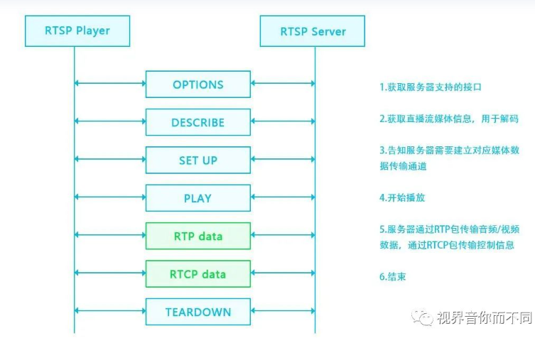

OPTIONS

C--->S

客户端向服务器端发现OPTIONS，请求可用的方法。

S--->C

服务器端回复客户端，消息中包含当前可用的方法。

DESCRIBE

C--->S

客户端向服务器请求媒体描述文件，一般通过rtsp开头的url来发起请求，格式为sdp。

S--->C

服务器回复客户端sdp文件，该文件告诉客户端服务器有哪些音视频流，有什么属性，如编解码器信息，帧率等。

SETUP

C--->S

客户端向服务器端发起建立连接请求，请求建立会话连接，准备开始接收音视频数据，请求信息描述了期望音视频数据包基于UDP还是TCP传输，指定了RTP，RTCP端口，以及是单播还是组播等信息！

S--->C

服务器端收到客户端请求后，根据客户端请求的端口号确定发送控制数据的端口以及音视频数据的端口!

PLAY

C--->S

客户端向服务端请求播放媒体。

S--->C

服务器回复客户端200 OK! 之后开始通过SETUP中指定的端口开始发送数据！

TEARDOWN

C---->S

结束播放的时候，客户端向服务器端发起结束请求

S--->C

服务端收到消息后，向客户端发送200 OK，之后断开连接

上述的流程基本涵盖了RTSP的流程，当然，RTSP除此之外，还有PAUSE，SCALE，GET_PARAMETER，SET_PARAMETER等参数。

## 请求消息格式

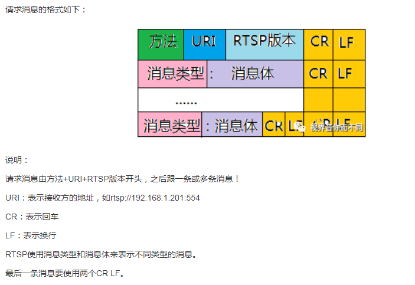

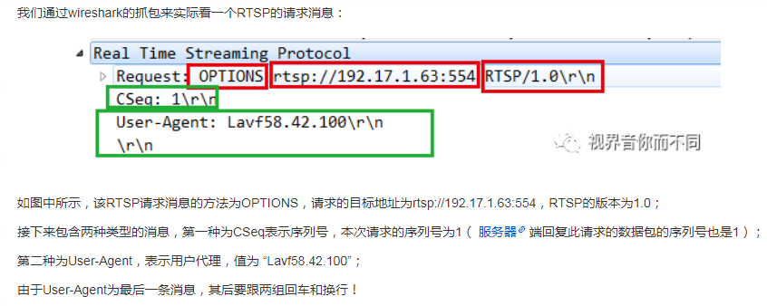

## 回复消息格式

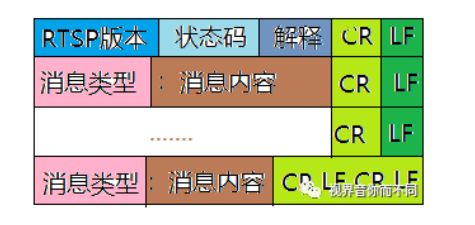

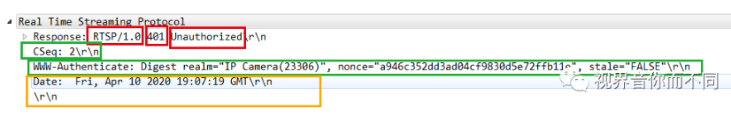


## SDP 格式

sdp 会话描述包含一个会话级描述（session_level_description）和多个媒体级描述（media_level description）组成！

会话级描述的作用域是整个会话，其位置从 "v=" 行开始到第一个媒体描述为止；
媒体级描述是对单个的媒体流进行描述，如传输过程中的视频流信息，从"m=" 开始到下一个媒体描述为止！

有些字段必选，有些可选（下图带 * 可选）

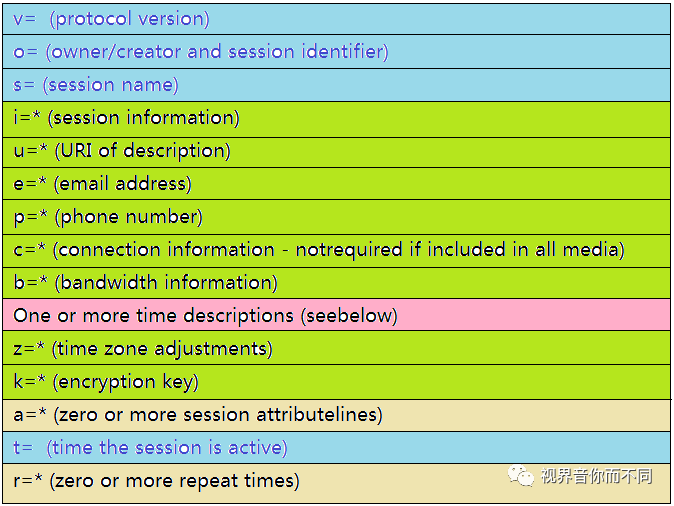

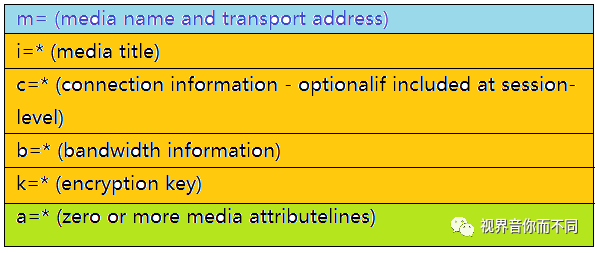


+ o(must)

```
格式：o = <username> <sessionid> <version> <network type> <address type> <address>
```

username：是用户的登录名, 如果主机不支持，则用"-"代替，username 不能包含空格；

sessionid：是一个数字串，在整个会话中，必须是唯一的，建议使用个NTP 时间戳;

version: 该会话公告的版本，供公告代理服务器检测同一会话的如果干个公告哪个是最新公告，基本要求是会话数据修改后该版本值递增，建议使用NTP时间戳

networktype: 网络类型，一般为"IN",表示internet

addresstype: 地址类型，一般为IP4

+ connection data
```
格式： c=<networktype> <address type> <connection address>
```
描述：表示媒体连接信息；一个会话级描述中必须有"c="或者在每个媒体级描述中有一个"c="选项，也可能在会话级描述和媒体级描述中都有"c="选项；

+ bandwidth(可选)
```
格式: b=<modifier>:<bandwidth-value>
```
描述：该选项描述了建议的带宽，单位 kbs/s，可选，modifier包括两种类型，CT和AS，CT表示总带宽，AS表示单个媒体带宽的最大值；bandwidth-value表示具体的带宽。

+ times(must)
```
格式：t=<start time> <stop time>
```
描述：t字段描述了会话的开始时间和结束时间，<start time> <stop time>为NTP时间，单位是秒；如果<stop time>为0表示过了<start time>之后，会话一直持续；当<start time> 和<stop time>都为0的时候，表示持久会话；建议两个值不设为0，如果设为0，不知道开始时间和结束时间，增大了调度的难度.


+ media information
```
格式：m=<media> <port> <transport type> <fmt list>
```
描述：

<media>表示媒体类型, 有"audio","video","application","data"（不向用户显示的数据）,"control"（描述额外的控制通道）;

<port>表示媒体流发往传输层的端口，一个用于音视频传输，一个用于RTCP;

<transport>表示传输协议，与"c="一行相关联，一般用RTP/AVP表示，即 Realtime Transport Protocol using the Audio/Video profile over udp，即我们常说的RTP over udp;

<fmt list>表示媒体格式，分为静态绑定和动态绑定

    静态绑定：媒体编码方式与RTP负载类型有确定的一一对应关系，如: m=audio 0 RTP/AVP 8

    动态绑定：媒体编码方式没有完全确定，需要使用rtpmap进行进一步的说明: 如： 
	m=video 0 RTP/AVP 96
	a=rtpmap:96 H264/90000


## OPTIONS
OPTIONS：标识请求命令的类型;

RTSP URI：请求的服务端的URI，以rtsp://开头的地址，一般为rtsp://ip:554(rtsp默认端口号);

RTSP VER：标识RTSP 版本号，一般常见RTSP/1.0;

CSeq：数据包序列号，由于OPTIONS一般而言为RTSP请求的第一条指令，一般而言，针对OPTIONS，该值为1;

User-Agent：用户代理;

## DESCRIBE
对于DESCRIBE消息，服务端的回复有两种可能！
如果需要认证，则首先返回401，并要求客户端认证，客户端再次发送包含认证信息的DESCRIBE指令，服务端收到带认证信息的DESCRIBE请求，返回sdp信息给客户端；
如果不需要认证，则直接返回sdp。

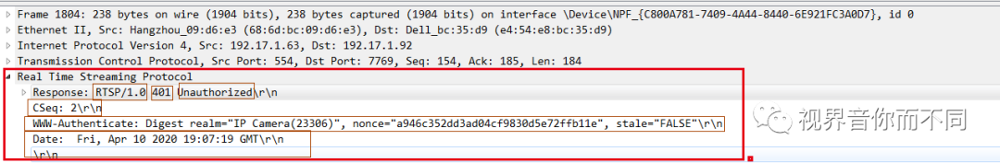

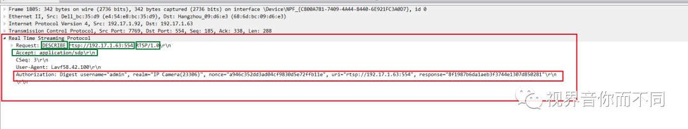

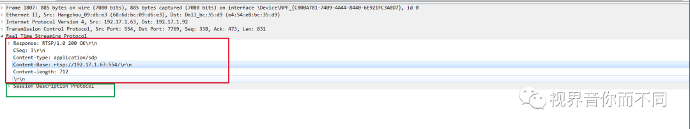

## SETUP 
SETUP请求的作用是指明媒体流该以什么方式传输；每个流PLAY之前必须执行SETUP操作；

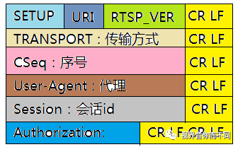

URI：请求的RTSP服务器的地址；

RTSP_VER：表明RTSP的版本；

TRANSPORT：表明媒体流的传输方式，具体包括传输协议如RTP/UDP；指出是单播，组播还是广播；声明两个端口，一个奇数，用于接收RTCP数据，一个偶数，用于接收RTP数据；

CSeq：数据包请求序列号；

User-Agent：指明用户代理；

Session：标识会话ID；

Authorization：标识认证信息；

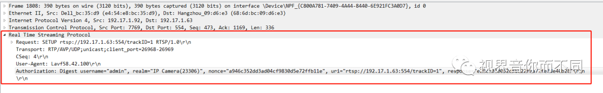

该SETUP请求中，Transport字段声明了两个端口，26968和26969，同时指明了通过UDP发送RTP数据，26968端口用来接收RTP数据，26969端口用来接收RTCP数据,unicast表示传输方式为单播！

请求之后，如果没有异常情况，RTSP服务器的回复比较简单，回复200 OK消息，同时在Transport字段中增加sever_port，指明对等的服务端RTP和RTCP传输的端口，增加ssrc字段，增加mode字段，同时返回一个session id，用于标识本次会话连接，之后客户端发起PLAY请求的时候需要使用该字段；

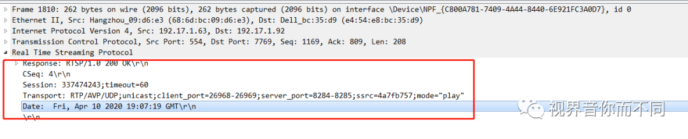

## PLAY 

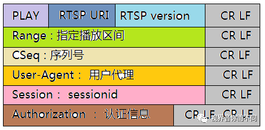

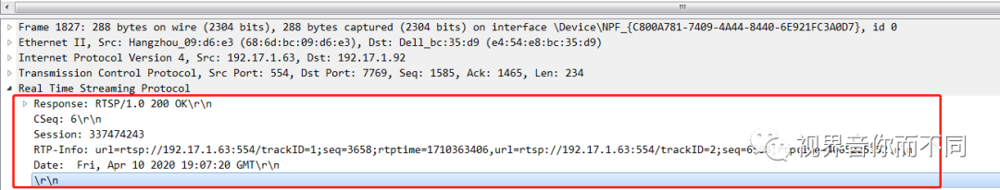

第一个url表示视频播放的地址，第一个seq表示第一个rtp视频数据包开始的序列号，第一个rtptime表示视频开始播放的时间戳，后面的一组表示音频播放相关的信息，同样也包括url，seq，rtptime！

## TEARDOWN
TEARDOWN是拆卸的意思，对于RTSP而言，就是结束流传输，同时释放与之相关的资源，TEARDWON之后，整个RTSP连接也就结束了！

