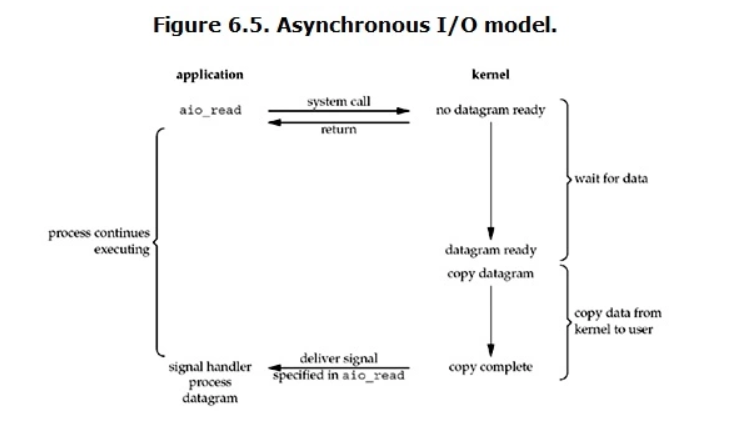

[TOC]

## socket 接口
### socket

`int socket(domain, type, protocol);`

| Domain  | 通信方式  | 识别socket | 结构 |
|---|---|---|---|
| AF_UNIX  | 内核  | 路径名 | sockaddr_un|
| AF_INET  | ipv4  | ipv4 + port | sockaddr_in |
| AF_INET6  | ipv6  | ipv6 + port | sockaddr_in6 |

type: SOCK_STREAM, SOCK_DGRAM

protocol: 0


### bind

`int bind(int sockfd, const struct sockaddr *addr, socklen_t addrlen);`

bind 的作用是绑定地址，但是不同的 domain 采用的结构不同，所以设计了 sockaddr 这种通用的地址结构。

#### 地址数据结构
```c
// 16B
struct sockaddr {
	sa_family_t sa_family;
	char        sa_data[14];
};

// 16B
struct sockaddr_in {
    sa_family_t     sin_family; 
    in_port_t       sin_port; // 端口号
    struct in_addr  sin_addr; // IPv4地址, uint32_t type
    char sin_zero[8]; // 不使用，填充0
};

// 28B
struct sockaddr_in6 {
    sa_family_t 		sin6_family; 
    in_port_t 			sin6_port; // 端口号
    uint32_t 			sin6_flowinfo; // IPv6流信息（暂未使用）
    struct in6_addr 	sin6_addr; // IPv6地址，uint8_t s6_addr[16]
    uint32_t 			sin6_scope_id; // 使用范围
};

// 128B
struct sockaddr_storage {
	sa_family_t ss_family;
	__ss_algntype __ss_align;   /*force alignment */
	char __ss_padding[SS_PADSIZE];  /* pad to 128B */
};
```

#### 地址转换
```C 
#define INET_ADDRSTRLEN 16

// ipv --> ipv6 最长需要46字节
#define INET6_ADDRSTRLEN 46  


// 网络地址和字符串转换
// addr 是 in_addr 或 in6_addr 结构
int addr_to_str(int af, const void *addr, char *str, size_t size) {
    const char *ret = NULL;
    if (af == AF_INET || af == AF_INET6) { 
        ret = inet_ntop(af, addr, str, size);
    } 

	return (NULL == ret ? -1 : strlen(str));
}

// addr 是 in_addr 或 in6_addr 结构
int str_to_addr(int af, const char *str, void *addr) {
    int ret = -1;
    if (af == AF_INET || af == AF_INET6) {
        ret = inet_pton(AF_INET, str, addr);
    } 

    if (ret == 0) { // 不合法的字符串格式，返回错误
        return -1;
    } else if (ret < 0) { // af 不合法
        return -1;
    } else { // 转换成功，返回地址长度
        return ret;
    }
}
```

### listen 
```c 
int listen(int sockfd, int backlog);
```

全连接队列长度：somaxconn 和 backlog 中的较小值；
全连接队列未满，连接请求会立即成功；全连接队列满了，会丢弃握手包，直到 accept 把未决连接从队列中移除；

### connect 

```
int connect(int sockfd, const struct sockaddr *addr,
            socklen_t addrlen);
```

TCP：如果 connect 失败，需要关闭这个socket ，然后新建一个，重新连接。

UDP：使用 connect 可以把 socket 和对端连接，通常用于需要向指定 <ip,port,udp> 发送对个消息的场景。绑定之后：
	
+ 只能与绑定的 socket 进行读写；再次 connect 可以修改已连接的对端；
+ 简化了系统调用，不用再指定地址了；
+ 会带来性能上的些微提升；


非阻塞connect
```c 
/*
The socket is nonblocking and the connection cannot be completed immediately.  
(UNIX domain sockets failed with EAGAIN instead.)  It is possible to select 
for completion by selecting the socket for writing.  

After select indicates writability, use getsockopt to read the SO_ERROR option 
at level SOL_SOCKET to determine whether connect() completed successfully (SO_ERROR 
is zero) or unsuccessfully (SO_ERROR is one of the usual error codes listed here, 
explaining the reason for the failure).
*/


 // 发起非阻塞连接请求
int ret = connect(sockfd, (struct sockaddr *)&server_addr, sizeof(server_addr));
if (ret == 0) {
	// 连接成功
	printf("Connected immediately!\n");
} else if (ret == -1) {
	if (errno == EINPROGRESS) {
		// 连接正在进行中
		printf("Connecting...\n");

		FD_ZERO(&write_fds);
		FD_SET(sockfd, &write_fds);

		timeout.tv_sec = 5; // 设置超时时间为 5 秒
		timeout.tv_usec = 0;

		ret = select(sockfd + 1, NULL, &write_fds, NULL, &timeout);
		if (ret < 0) {
			perror("select");
			exit(EXIT_FAILURE);
		} else if (ret == 0) {
			// 连接超时
			printf("Connection timeout\n");
			exit(EXIT_FAILURE);
		} else {
			// 可写事件发生，连接成功建立
			if (FD_ISSET(sockfd, &write_fds)) {
				int err = 0;
				if (getsockopt(sockfd, SOL_SOCKET, SO_ERROR, &err, &errlen) < 0) {
					perror("error");
					exit(EXIT_FAILURE);
				}
				if (err) {
					perror("error");
					exit(EXIT_FAILURE);					
				}

			}
			else {
				perror("error");
				exit(EXIT_FAILURE);
			}
		}
	} else {
		// 连接出错
		perror("connect");
		exit(EXIT_FAILURE);
	}
}
```

### accept

```c 
int accept(int sockfd, struct sockaddr *addr, socklen_t *addrlen);
```

```c 
// 获取本地地址
int getsockname(int sockfd, struct sockaddr *addr, socklen_t *addrlen);
					   
// 获取对端地址
int getpeername(int sockfd, struct sockaddr *addr, socklen_t *addrlen);
```

由 accept 返回的新的 fd 继承了大部分套接字选项，还有部分不会被继承。在 Linux 中，如下不会被继承：

+ 可以通过 fcntl() 的 F_SETFL 修改的标记，包括：O_NONBLOCK、O_ASYNC；
+ 可以通过 fcntl() 的 F_SETFD 修改的标记，即：FD_CLOEXEC;
+ 与信号驱动相关联的文件描述符属性；


### close 

关闭一个流，如果多个文件描述符引用了同一个 socket，那么当所有描述符都关闭后连接就会终止。

关闭之后，当对端从连接读取数据时，会收到文件结束；向连接写入数据时，会引发 SIGPIPE。

### shutdown
```c 
// 可以指定关闭一端，还是两端
int shutdown(int sockfd, int how);

// 文件描述符不会被关闭
fd2 = dup(sockfd);
close(sockfd);

// 套接字通道依然关闭，无法再读写了
// sockfd 要调用 close 关闭
fd2 = dup(sockfd);
shutdown(sockfd, SHUT_RDWR);
```

shutdown 与 close 差异：
+ 可以指定关闭一端，还是两端；
+ shutdown 关闭的是套接字通道，要关闭文件描述符必须调用close；
+ 如果该套接字关联其他文件描述符，shutdown依然能关闭通道；
+ 尽量不要使用 SHUT_RD ,不同的实现中效果不一致，在 Linux 中可能也不符合你的期望；

## Unix Socket
### unix domain 中socket
```C 
struct sockaddr_un {
	sa_family_t sun_family;
	char sun_path[108];
};


int sfd = socket(AF_UNIX, SOCK_STREAM, 0);
if (-1 == sfd) return ;

// unix socket 要绑定到一个地址
// 一个 socket 和 一个地址是一一对应，所以必须先删除
// ENOENT：path 不存在
// 客户端必须在这个 socket 文件上有读写权限，否则无法连接；
if (remove(SV_SOCK_PATH) == -1 && errno != ENOENT)
	return ;

memset(&addr, 0, sizeof(struct sockaddr_un));
addr.sun_family = AF_UNIX;
strncpy(addr.sun_path, SV_SOCK_PATH, sizeof(addr.sun_path)-1);

if (bind(sfd, (struct sockaddr*)&addr, sizeof(struct sockaddr_un)) == -1)
	return ;

if (listen(sfd, backlog) == -1)
	return ;
```

unix socket 数据包是可靠的 --- UDP socket 不可靠；
在 unix socket 上发送数据包，如果负责接收的 socket 数据队列满了，会导致阻塞 --- UDP socket 会丢弃数据；


### 互联 socket 对
```c 
int socketpair(AF_UNIX, int type, int protocol, int sockfd[2]);
```
socket 对的使用方式，与管道类似，用于父子进程间通信；

### 抽象 socket 名空间
Linux 特有的，优势：无需为 socket 创建一个文件系统路径名了，因此也不用担心和其他 socket 冲突；

```c 
int sfd = socket(AF_UNIX, SOCK_STREAM, 0);
if (-1 == sfd) return ;

// 第一个字节必须为 null，这样能区分抽象 socket 与传统 unix socket
memset(&addr, 0, sizeof(struct sockaddr_un));
addr.sun_family = AF_UNIX;
strncpy(addr.sun_path[1], "my_prog", sizeof(addr.sun_path)-2);

if (bind(sfd, (struct sockaddr*)&addr, sizeof(struct sockaddr_un)) == -1)
	return ;

if (listen(sfd, backlog) == -1)
	return ;
```


## 常用接口

```C 
// UDP: 一次读一条消息，如果消息长度超过 length，消息会被截断为 length 字节
ssize_t recvfrom(int socket, void *buffer, size_t length,
           int flags, struct sockaddr *address,
           socklen_t *address_len);

```

```c 
// 读 n 个字节
int32_t readn(int32_t fd, void *buffer, uint32_t n) {
    int32_t total = 0;  // 已读取的总字节数
    int32_t bytes_read; // 每次读取的字节数

    while (total < n) {
        bytes_read = read(fd, buffer + total, n - total);
        if (bytes_read < 0) {
			if (errno == EINTR)
				continue ;
			else if (errno == EAGAIN) // 缓冲区无数据
				break ;
			else
	            return -1; // 读取出错
        } else if (bytes_read == 0) {
            break; // 到达文件结尾，退出循环
        }
        total += bytes_read;
    }

    return total; // 返回已读取的总字节数
}
```

```c 
// 写 n 个字节
int32_t writen(int32_t fd, const void *buffer, uint32_t n) {
    int32_t total = 0;   // 已写入的总字节数
    int32_t bytes_written; // 每次写入的字节数

    while (total < n) {
        bytes_written = write(fd, buffer + total, n - total);
        if (bytes_written < 0) {
			if (errno == EINTR)
				continue ;
			else if (errno == EAGAIN) // 缓冲区满
				break ;
			else
	            return -1; // 写入出错
        } else if (bytes_written == 0) {
            break; // 无法写入更多数据，退出循环
        }
        total += bytes_written;
    }

    return total; // 返回已写入的总字节数
}
```

```C
// 类似于 read write，但通过 flag 提供了更多特性
ssize_t recv(int sockfd, void buf[.len], size_t len,int flags);

ssize_t send(int sockfd, const void buf[.len], size_t len, int flags);

MSG_DONTWAIT : 以非阻塞方式执行，如果资源不可用，立刻返回 EAGAIN；

MSG_PEEK：从缓冲区获取一份副本，但不会从缓冲区移除数据；

MSG_MORE: 在连续的 send 或 sendto 调用中，数据会被打包成一个单独的数据包 或者 TCP 报文段；直到或者下次调用没有该标记，或者达到上限，或者超过一定时间，或者fd关闭；
```

```c
// 零拷贝读文件发送
// out_fd: socket fd
// in_fd:  file fd，可以进行 mmap 操作
// before：disk --> kernel --> userspace --> socket buffer
// now: disk --> kernel --> socket buffer
// 减少了2次内核与应用层拷贝，增加了内核与内核拷贝
ssize_t sendfile(int out_fd, int in_fd, off_t *offset size_t count);


// 适用场景：发送 协议头 + 少量文件内容 + 利用零拷贝
// 把协议头和少量数据，放在一个报文段，节省带宽

// TCP_CORK：针对 socket
// MSG_MORE：针对每次调用
启用 TCP_CORK 选项后，之后所有的输出都会缓冲到一个单独的 TCP 报文段中，直到满足下列条件为止：达到报文段上限、取消了 TCP_CORK 选项、套接字被关闭、从写入第一个字节开始经历了 200ms；

opt = 1;
setsockopt(sockfd, IPPROTO_TCP, TCP_CORK, &opt, sizeof(opt));

write(sockfd, ...);
sendfile(sockfd, ...);

opt = 0;
setsockopt(sockfd, IPPROTO_TCP, TCP_CORK, &opt, sizeof(opt));


```

## 网络模型
### 常见 IO 模型
+ 阻塞IO（blocking IO）
+ 非阻塞IO（nonblocking IO）
+ IO 多路复用（IO socket）
+ 异步 IO （asynchronous IO）
+ 信号驱动 IO（signal driven IO）：信号处理复杂，不常用




### 边缘触发 vs 水平触发
水平触发(level-triggered)：
+ socket接收缓冲区不为空 有数据可读 读事件一直触发
+ socket发送缓冲区不满 可以继续写入数据 写事件一直触发

边沿触发(edge-triggered):
+ socket的接收缓冲区状态变化时触发读事件，即空的接收缓冲区刚接收到数据时触发读事件
+ socket的发送缓冲区状态变化时触发写事件，即满的缓冲区刚空出空间时触发读事件
+ 边缘触发仅触发一次，水平触发会一直触发。

使用边缘触发和水平触发的模型：
+ select/poll : 水平触发；
+ 信号驱动IO : 边缘触发；
+ epoll : 水平触发、边缘触发；
+ libevent : 水平触发;
+ nginx : 边缘触发;

边缘触发和水平触发的比较：
+ 水平触发：程序设计上更简单，因为可以重复检查文件描述符是否处于就绪状态；
+ 边缘触发：只有状态变化才会触发；一般会把文件描述符设置为非阻塞，然后在收到事件时，尽可能多的地执行I/O, 直到系统调用的错误码为 EAGAIN 或 EWOULDBLOCK；这种设计，容易导致数据丢失，或者出现某些文件描述符处于饥饿状态；

### 阻塞与非阻塞IO
总体上，在我们的模型中，使用非阻塞IO 优于阻塞IO。

使用阻塞IO 会出现明显问题的例子：
+ 边缘触发中，必须使用非阻塞IO，否则导致其他 fd 饥饿；
+ 水平触发中，write 大量数据也可能导致阻塞，这可能不是预期的效果；
+ 多进程或多线程模型中，使用阻塞IO 会降低进程、线程的利用率；
+ 有时候，会出现虚假的就绪通知，使用阻塞IO会导致线程卡死；

## epoll 
### epoll 为什么高效

+ 阻塞不会导致低性能，过多过频繁的阻塞才会;
+ 同步阻塞IO，用户进程在阻塞的时候让出CPU，会有进程上下文切换；收到数据，被操作系统唤醒又发生一次进程上下文切换。这两次切换在程序员看来，都是浪费的;
+ epoll 高效的关键，在于极大地减少了无用的上下文切换。在高并发的场景中，就绪队列上会一直有活，epoll_wait获取到事件、处理完、马上继续处理下一个，用户进程完全不用阻塞。直到没有事件了，或者时间片用完了，用户进程才会让出CPU;


### 性能不会随监听的文件描述符的增长而下降

调用epoll_create时，内核除了帮我们在epoll文件系统里建了个file结点，在内核cache里建了个红黑树 用于存储以后epoll_ctl传来的socket外，还会再建立一个list链表，用于存储准备就绪的事件.

当epoll_wait调用时，仅仅观察这个list链表里有没有数据即可。有数据就返回，没有数据就sleep，等到timeout时间到后即使链表没数据也返回。通常情况下即使我们要监控百万计的句柄，大多一次也只返回很少量的准备就绪句柄而已，所以，epoll_wait仅需要从内核态copy少量的句柄到用户态而已.

那么，这个准备就绪list链表是怎么维护的呢？

当我们执行epoll_ctl时，除了把socket放到epoll文件系统里file对象对应的红黑树上之外，还会给内核中断处理程序注册一个回调函数，告诉内核，如果这个句柄的中断到了，就把它放到准备就绪list链表里。所以，当一个socket上有数据到了，内核在把网卡上的数据copy到内核中后就来把socket插入到准备就绪链表里了。

因此，IO性能不会随着监听的文件描述的数量增长而下降。


### 数据结构

+ EPOLLIN ： 表示对应的文件描述符可以读（包括对端SOCKET正常关闭）；
+ EPOLLOUT： 表示对应的文件描述符可以写；
+ EPOLLPRI： 表示对应的文件描述符有紧急的数据可读（这里应该表示有带外数据到来）；
+ EPOLLERR： 表示对应的文件描述符发生错误；
+ EPOLLHUP： 表示对应的文件描述符被挂断；
+ EPOLLET： 将 EPOLL设为边缘触发(ET)模式（默认为水平触发）
+ EPOLLONESHOT： 只监听一次事件，当监听完这次事件之后，如果还需要继续监听这个socket的话，需要再次把这个socket加入到EPOLL队列里

```c 
#include <sys/epoll.h>

struct epoll_event {
	uint32_t      events;  /* Epoll events */
	epoll_data_t  data;    /* User data variable */
};

union epoll_data {
	void     *ptr;
	int       fd;
	uint32_t  u32;
	uint64_t  u64;
};

typedef union epoll_data  epoll_data_t;
```

### 实例 
```c 
#define MAX_EVENTS 10
struct epoll_event ev, events[MAX_EVENTS];
int listen_sock, conn_sock, nfds, epollfd;

/* Code to set up listening socket, 'listen_sock',
	(socket(), bind(), listen()) omitted */

// 创建epoll实例
epollfd = epoll_create1(0);

if (epollfd == -1) {
	perror("epoll_create1");
	exit(EXIT_FAILURE);
}

// 将监听的端口的socket对应的文件描述符添加到epoll事件列表中
ev.events = EPOLLIN;
ev.data.fd = listen_sock;
if (epoll_ctl(epollfd, EPOLL_CTL_ADD, listen_sock, &ev) == -1) {
	perror("epoll_ctl: listen_sock");
	exit(EXIT_FAILURE);
}

for (;;) {
	// epoll_wait 阻塞线程，等待事件发生
	nfds = epoll_wait(epollfd, events, MAX_EVENTS, -1);
	if (nfds == -1) {
		perror("epoll_wait");
		exit(EXIT_FAILURE);
	}

	for (n = 0; n < nfds; ++n) {
		if (events[n].data.fd == listen_sock) {
			// 新建的连接
			conn_sock = accept(listen_sock,
								(struct sockaddr *) &addr, &addrlen);
			// accept 返回新建连接的文件描述符
			if (conn_sock == -1) {
				perror("accept");
				exit(EXIT_FAILURE);
			}
			// 将该文件描述符置为非阻塞状态	
			setnonblocking(conn_sock);

			ev.events = EPOLLIN;
			ev.data.fd = conn_sock;
			if (epoll_ctl(epollfd, EPOLL_CTL_ADD, conn_sock,
						&ev) == -1)
				perror("epoll_ctl: conn_sock");
				exit(EXIT_FAILURE);
			}
		} else {
			// 使用已监听的文件描述符中的数据
			do_use_fd(events[n].data.fd);
		}
	}
}

void setnonblocking(int fd)
{
	int flags = fcntl(fd, F_GETFL);
	if (!(flags & O_NONBLOCK)) {
		flags |= O_NONBLOCK;
		fcntl(fd, F_SETFL, flags);
	}
}
```

### 边缘触发防止饥饿

+ epoll_wait 监视文件描述符，并将就绪的描述符添加到应用程序列表中；

+ 对应用程序列表中就绪的文件描述符执行有限量的I/O操作（可能是以轮转调度方式 round-robin 依次处理它们，而不是每次调用 epoll_wait 后总是从列表开头开始）。当相关的非阻塞 I/O 系统调用返回 EAGAIN 或 EWOULDBLOCK 错误时，可以将文件描述符从应用程序列表中删除；

+ 如果应用程序列表中存在就绪的文件描述符，那么下一次 epoll_wait 的超时时间应该很短或为0，以便如果没有新的文件描述符就绪，应用程序可以快速进入下一步并处理任何就绪的文件描述符；


## select 

```c 
int select(int nfds, fd_set *_Nullable restrict readfds,
                  fd_set *_Nullable restrict writefds,
                  fd_set *_Nullable restrict exceptfds,
                  struct timeval *_Nullable restrict timeout);
```

timeout : 超时时间；每次调用 select 前，都要初始化；


### 性能随监听的文件描述符数量增长而下降

+ select 的时候需要向内核传递一个数据结构，包含了所有待监视的文件描述符，随数量 N 增大导致性能下降；
+ 每次 select 需要检查所有待监视的文件描述符，好比你要把每个鱼竿都抬起来看有没有鱼；

### select 和 epoll 性能对比

| 监视的数量  | select 占用的cpu时间  | epoll占用的cpu时间|
|---|---|---|
| 10  |  0.73 | 0.41|
| 100  | 3.0  |0.42 |
| 1000  | 35  |0.53 |
| 10000  | 930  | 0.66|
